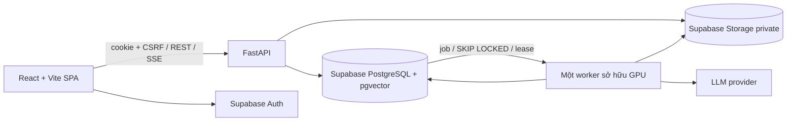
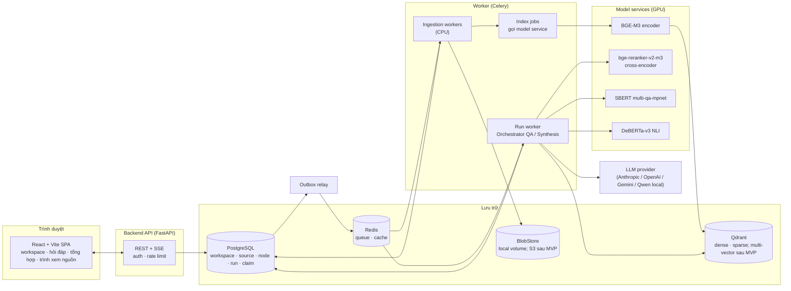
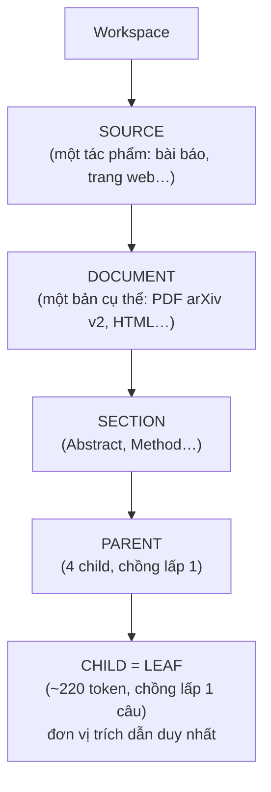
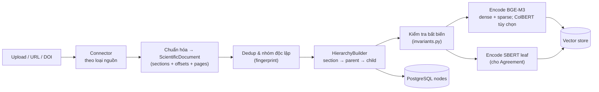
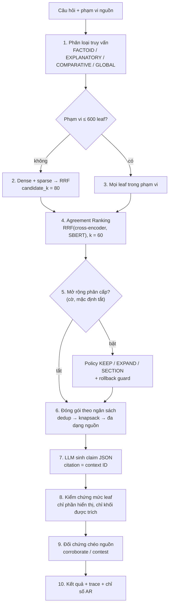
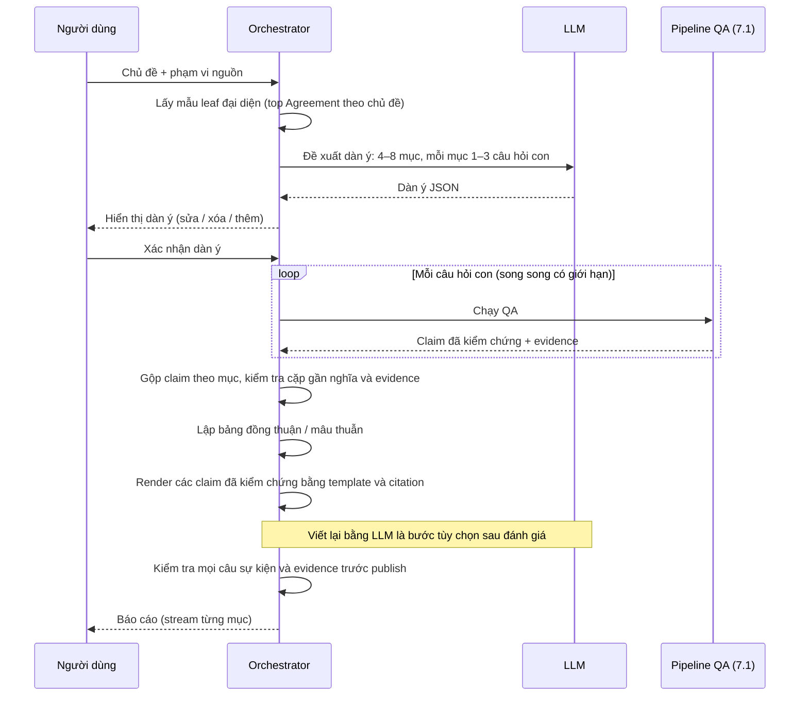

# Kiến trúc hệ thống: Tổng hợp kiến thức đa nguồn có kiểm chứng

> **Tên dự án:** MSKS — Multi-Source Knowledge Synthesis
> **Đề tài:** Xây dựng hệ thống web tổng hợp kiến thức đa nguồn có kiểm chứng bằng truy xuất phân cấp thích ứng và mô hình ngôn ngữ lớn
> **Nền tảng kế thừa:** dự án EDAHR / *Attribution-Risk-Constrained Adaptive Hierarchical Retrieval*, cấu hình **v11** (`D:\AI PROJECT\Evidence-Density-Aware Adaptive Hierarchical Retrieval for Scientific Document Question Answering`)
> **Phiên bản tài liệu:** 0.3 — 2026-10-08 (đối chiếu mã MVP)
> **Trạng thái:** Đã có frontend, API, worker và migration MVP. Chưa nghiệm thu production hoặc benchmark chất lượng/hiệu năng. Xem [báo cáo rà soát](REVIEW_2026-10-08.md).
> **Cách đọc:** Mục 0.1 ghi quyết định triển khai hiện tại và được ưu tiên khi khác bản thiết kế đích bên dưới. Các mục mô tả tính năng/stack đích không có nghĩa mã đã hoàn thành chúng.

---

## Mục lục

0. [Đánh giá và quyết định trước triển khai](#0-đánh-giá-và-quyết-định-trước-triển-khai)
1. [Mục tiêu và phạm vi](#1-mục-tiêu-và-phạm-vi)
2. [Kế thừa từ v11: những gì giữ, những gì mở rộng](#2-kế-thừa-từ-v11-những-gì-giữ-những-gì-mở-rộng)
3. [Yêu cầu](#3-yêu-cầu)
4. [Kiến trúc tổng thể](#4-kiến-trúc-tổng-thể)
5. [Mô hình dữ liệu phân cấp](#5-mô-hình-dữ-liệu-phân-cấp)
6. [Pipeline nạp tài liệu (offline)](#6-pipeline-nạp-tài-liệu-offline)
7. [Pipeline truy vấn và tổng hợp (online)](#7-pipeline-truy-vấn-và-tổng-hợp-online)
8. [Kiểm chứng và rủi ro quy kết đa nguồn](#8-kiểm-chứng-và-rủi-ro-quy-kết-đa-nguồn)
9. [Cấu trúc mã nguồn](#9-cấu-trúc-mã-nguồn)
10. [API backend](#10-api-backend)
11. [Frontend](#11-frontend)
12. [Lưu trữ và hạ tầng](#12-lưu-trữ-và-hạ-tầng)
13. [Cấu hình](#13-cấu-hình)
14. [Đánh giá](#14-đánh-giá)
15. [Bảo mật, quan sát, tái lập](#15-bảo-mật-quan-sát-tái-lập)
16. [Lộ trình triển khai](#16-lộ-trình-triển-khai)
17. [Rủi ro và câu hỏi mở](#17-rủi-ro-và-câu-hỏi-mở)
18. [Nguồn đối chiếu](#18-nguồn-đối-chiếu)

---

## 0. Đánh giá và quyết định trước triển khai

**Kết luận:** Hướng nghiên cứu phù hợp để phát triển thành sản phẩm: quy kết tới leaf, lưu evidence, kiểm chứng độc lập generator và benchmark có đối chứng. Tuy nhiên, bản 0.1 còn thiếu hợp đồng vận hành và diễn giải quá mạnh một số kết quả thực nghiệm. Nên triển khai sau khi chốt các quyết định dưới đây, bắt đầu bằng một luồng PDF → QA → trích dẫn có thể kiểm tra.

| Ưu tiên | Vấn đề của bản 0.1 | Quyết định trong bản 0.2 |
|---|---|---|
| P0 | Chế độ kho nhỏ bị đồng nhất với parity v11 | Tách `v11_parity` và `product`; chỉ profile parity cố định toàn bộ pipeline mới dùng để kiểm tra tương đương |
| P0 | NLI/lexical fallback bị hiểu như bảo đảm sự thật; CRC mở rộng thiếu giả định | Nhãn “được bằng chứng hỗ trợ”; ngưỡng sản phẩm phải hiệu chỉnh; CRC đa nguồn chỉ là nghiên cứu khi chưa kiểm tra giả định |
| P0 | Citation gắn node có thể thay đổi khi parse/index lại | Document revision, parse revision và evidence snapshot bất biến; quy ước offset rõ ràng |
| P0 | Thiếu vòng đời job, retry, publish index và phục hồi SSE | Job bền vững trong PostgreSQL, outbox, xử lý lặp an toàn, index publish có kiểm tra, event có số thứ tự |
| P0 | Phạm vi rộng: nhiều connector, ba biểu diễn vector, nhiều LLM, nhiều định dạng xuất | MVP PDF có text + MD/TXT, QA, audit, xuất MD/JSON; các phần còn lại triển khai sau |
| P1 | Tốc độ index v11 và dung lượng trọng số bị suy ra thành SLO/VRAM sản phẩm | Đo end-to-end, cold/warm, số leaf, concurrency, peak VRAM; không cam kết từ số đo v11 |
| P1 | Fingerprint bị dùng như bằng chứng độc lập nguồn | Fingerprint phát hiện phụ thuộc; khác fingerprint chỉ là chưa biết; lưu lý do và phiên bản phân nhóm |
| P1 | Tên đề tài nhấn mạnh phân cấp thích ứng trong khi tính năng mặc định tắt | Giữ phân cấp làm cấu trúc provenance; đánh giá adaptive expansion bằng ablation riêng trước khi tuyên bố đóng góp |

P0 là điều kiện trước demo nhiều người dùng; P1 là điều kiện trước công bố kết quả/khẳng định chất lượng. Bảng trên giữ lịch sử đánh giá thiết kế ngày 07/10. Số liệu v11 chưa được chạy lại trong đợt rà soát này.

### 0.1 Kiến trúc MVP thực tế — quyết định ngày 08/10/2026



| Thành phần | Quyết định MVP | Điều kiện xem lại |
|---|---|---|
| Frontend | React/Vite SPA, React Router, TanStack Query; giữ stack hiện có | Chỉ chuyển Next.js nếu có nhu cầu SSR/SEO cụ thể |
| Retrieval | pgvector dense/sparse/SBERT, exact scan theo generation | Đo latency/recall và RAM trên 20.000 leaf; chưa được khẳng định “đủ nhanh” khi chưa benchmark. Qdrant là phương án sau đo |
| Queue | Bảng job PostgreSQL, SKIP LOCKED, lease và attempt fencing | Khi backlog/độ trễ không đạt, tách ingest và QA; Celery/Redis không phải dependency MVP |
| Blob | Supabase Storage bucket riêng tư | Cần reconciler xử lý blob mồ côi khi Storage thành công nhưng DB thất bại |
| Auth | Supabase JWT → cookie HttpOnly, CSRF cho API nghiệp vụ | Hoàn thiện bảo vệ Origin trên endpoint phiên và cách ly query cache khi đổi tài khoản trước public |
| Triển khai | Vite dev proxy `/api` hiện có | Production cần reverse proxy cùng origin, SPA fallback, TLS/cookie Secure; `vite preview` không tự cung cấp proxy production |

Mọi thay đổi trạng thái worker phải giữ khóa job và kiểm tra `attempt_version`, state, lease; API hủy run lấy khóa theo cùng thứ tự **job → run**. Số lần nhận job tính theo attempt, gồm cả crash; không chỉ dựa vào retry_count. Công bố QA kiểm tra lại cancel và tombstone trong transaction. Run được tạo với config hash; worker từ chối chạy khi config đã đổi thay vì ghi provenance sai. Chưa có replay raw LLM response vì hiện chỉ lưu hash.

SSE phát lại claim từ DB và evidence qua DTO có kiểm tra tombstone; không trả nguyên snapshot event cũ. Migration `0006_tombstone_read_protection.sql` chặn đọc trực tiếp `run_event` qua Data API và bổ sung lọc tombstone cho canonical text. Migration đã được viết, **chưa áp dụng lên Supabase trong lần rà soát**.

MVP vẫn thiếu calibration artifact được xác minh, hard timeout cho parser/model, trần token LLM/NLI, worker heartbeat dành cho readiness và kiểm thử tranh chấp trên DB thật. Các yêu cầu tương ứng bên dưới là tiêu chí phải hoàn thiện, không phải tính năng đã có. Danh sách ưu tiên và kiểm thử nằm trong [REVIEW_2026-10-08.md](REVIEW_2026-10-08.md).

---

## 1. Mục tiêu và phạm vi

### 1.1 Bài toán

Người dùng đưa vào **nhiều nguồn** (PDF khoa học, DOCX, trang web, Markdown, bản ghi API học thuật) và đặt **câu hỏi** hoặc **chủ đề cần tổng hợp**. Hệ thống trả về một bản tổng hợp trong đó:

- **Mọi khẳng định sự kiện trong nội dung chính đều quy được về evidence thuộc leaf cụ thể** của một phiên bản nguồn cụ thể; có vị trí ký tự và trang nếu định dạng có phân trang. Đây là nguyên tắc trung tâm kế thừa từ repo gốc. “Có bằng chứng hỗ trợ” không đồng nghĩa với “sự thật đã được chứng minh”.
- Claim không được bằng chứng ủng hộ thì **bị loại**, không bị che.
- Các nguồn **xác nhận** hoặc **mâu thuẫn** nhau được hiển thị rõ.
- Người đọc bấm vào trích dẫn sẽ thấy ngay đoạn văn gốc được tô sáng.

### 1.2 Hai chế độ sử dụng

| Chế độ | Đầu vào | Đầu ra |
|---|---|---|
| **Hỏi đáp (QA)** | 1 câu hỏi + tập nguồn | Câu trả lời ngắn (≤120 từ, như v11), danh sách claim có trích dẫn |
| **Tổng hợp (Synthesis)** | 1 chủ đề + tập nguồn | Báo cáo nhiều mục, mỗi mục gồm các claim đã kiểm chứng, bảng đồng thuận / mâu thuẫn giữa các nguồn |

Chế độ Tổng hợp được xây trên chế độ QA: chủ đề được tách thành câu hỏi con, mỗi câu hỏi chạy pipeline QA sản phẩm có version. Pipeline này kế thừa v11 nhưng phải được đánh giá riêng khi thêm truy xuất toàn kho, ràng buộc nguồn và đối chứng chéo.

### 1.3 Ngoài phạm vi (giai đoạn đầu)

- Thu thập web tự động quy mô lớn (crawler). Chỉ nạp URL người dùng cung cấp.
- Huấn luyện lại mô hình. Ưu tiên model đã dùng ở v10/v11; adapter/model mới chỉ được bật sau đánh giá, không kế thừa kết luận v11 một cách tự động.
- Đa ngôn ngữ đầy đủ. Ưu tiên tiếng Anh (như dữ liệu v11); tiếng Việt hỗ trợ ở mức phân loại truy vấn (bộ từ khóa trong `pipeline.classify_query` đã có cụm tiếng Việt).

### 1.4 Phạm vi MVP được đề xuất

- **Có trong MVP:** workspace riêng theo người dùng; PDF có text, MD/TXT; job nạp bất đồng bộ; QA tiếng Anh trên tập nguồn đã chọn; citation mở đúng evidence snapshot; audit; lịch sử; xuất Markdown/JSON.
- **Sau MVP:** DOCX/HTML/URL/DOI, OCR và bảng phức tạp, đối chứng chéo, synthesis, xuất DOCX/PDF, LLM local. UI tiếng Việt không đồng nghĩa pipeline đã hỗ trợ QA tiếng Việt.
- **Stack chốt cho MVP:** React + Vite (TypeScript, SPA) + FastAPI; một Python package; job trên PostgreSQL; pgvector dense/sparse/SBERT; Supabase Storage qua `BlobStore`, Supabase Auth. Celery/Redis/Qdrant là phương án mở rộng cần có số đo chứng minh nhu cầu.
- **Một provider LLM được cấu hình khi chạy**, không cần hoàn thiện mọi adapter ở G0. Chỉ số/tham số chưa có thực nghiệm MSKS được ghi rõ là giả thuyết hoặc giá trị khởi đầu.

---

## 2. Kế thừa từ v11: những gì giữ, những gì mở rộng

### 2.1 Phương pháp v11 tóm tắt

v11 là lượt **kiểm tra độ bền** cho kết luận v10, không thay đổi phương pháp (`analysis/v11_protocol.md`). Ba nhánh được đóng băng:

| Nhánh | Cách chọn ứng viên | Ghi chú |
|---|---|---|
| `raptor` | Cây RAPTOR (SBERT + UMAP + tóm tắt BART) → pool → cross-encoder | Baseline tham chiếu |
| `all_leaf` | Cross-encoder chấm **mọi leaf** của tài liệu | Rerank toàn bài |
| `agreement` | **Agreement Ranking**: RRF(k=60) của hạng cross-encoder và hạng cosine SBERT câu hỏi–leaf | Phương pháp đề xuất |

Agreement Ranking (`src/edahr/agreement.py`) không có tham số học, không cây, không tóm tắt, không gọi LLM khi index. Thứ tự lấy từ RRF; điểm đưa cho bộ đóng gói là **phân bố điểm của cross-encoder gán theo thứ tự mới** (chỉ đổi thứ tự, không đổi thang điểm).

Phần dùng chung giữa ba nhánh:

1. **Bộ đóng gói** (`context.assemble_context` + `experimental_v9.select_units`): khử trùng lặp Jaccard ≥ 0,85 → top `final_context_k` → knapsack 0/1 theo bucket 64 token → sửa đa dạng nguồn → chọn tham lam theo ngân sách chính xác (cl100k, gồm header nguồn 24 token mỗi khối).
2. **Generator**: prompt grounded trả JSON `{answerable, reason, claims[{text, citations, confidence}]}`, citation chỉ được dùng các context ID có thật; giới hạn 120 từ.
3. **Verifier chỉ đọc phần hiển thị** (`experimental_v9.verify_visible`): mỗi claim chỉ được kiểm NLI với **đúng các khối nó trích dẫn**, và chỉ phần văn bản thực sự nằm trong context.
4. **Chấm điểm**: Evidence F1 kiểu QASPER, độ phủ ký tự gold, Leaf F1, Answer F1; kiểm định sign-flip theo bài, Holm, biên non-inferiority 0,02.

### 2.2 Kết quả v11 và hệ quả cho thiết kế

| Kết quả v11 | Hệ quả thiết kế |
|---|---|
| PeerQA × gpt-4o-mini: Agreement **không kém** RAPTOR (+0,011, Holm p<0,001); rerank toàn bài cũng không kém | Dùng **Agreement Ranking làm bộ chọn mặc định**. Không dựng cây RAPTOR trong hệ thống web. |
| Index RAPTOR 70 bài: 3.097 s; Agreement: 32 s (~100×) | Có cơ sở bỏ chi phí dựng RAPTOR trong phạm vi benchmark; không suy ra tốc độ parse, BGE-M3 hay nạp end-to-end của MSKS |
| Trên bài dài của PeerQA, RAPTOR đóng gói **ít gold nhất** ở mọi ngân sách đã thử | Chưa có lý do bật tóm tắt trừu tượng trong MVP; chưa đủ để kết luận cho mọi tài liệu dài hoặc synthesis |
| Không chứng minh được Agreement **tốt hơn** all_leaf | Giữ full-scan `all_leaf` trong benchmark và `cross_encoder` trên cùng pool trong sản phẩm; không quảng cáo Agreement là vượt trội |
| Với Qwen2.5-7B, khác biệt giữa ba bộ chọn nằm trong dao động do generator | Lớp generator phải **thay được**; chất lượng trích dẫn phụ thuộc generator → cần lớp kiểm chứng độc lập với generator |
| Qwen JSON hợp lệ 97,7–99,2%; lỗi được ghi nhận, không che | Giữ hợp đồng: lượt lỗi định dạng = không có claim, hiển thị lý do cho người dùng |
| Sửa đổi 3: id nguồn dài làm vượt ngân sách header 24 token | Header context dùng **bí danh ngắn** (`S1`, `S2`…), metadata đầy đủ nằm ngoài prompt |

### 2.3 Bảng ánh xạ module

| Module EDAHR (v11) | Vai trò | Trong MSKS |
|---|---|---|
| `ingestion.py` (Docling) | Parse PDF có bố cục | **Giữ**, bọc trong `connectors/pdf.py` |
| `peerqa.py`, `qasper.py` | Chuyển dữ liệu benchmark | Giữ trong `benchmarks/`; làm mẫu cho connector HTML/GROBID |
| `hierarchy.py` | Cây document/section/parent/child, id SHA-1 ổn định | **Giữ**, liên kết SOURCE bên ngoài bằng adapter |
| `index.py` (BGE-M3 dense+sparse+ColBERT) | Truy xuất | **Mở rộng**: dùng làm bước sinh ứng viên toàn kho (mới, vì đa nguồn) |
| `agreement.py` | Agreement Ranking | **Giữ nguyên**, là bộ xếp hạng mặc định |
| `policy.py`, `expansion.py` | Gộp child→parent→section thích ứng | **Tùy chọn** (cờ cấu hình), tắt mặc định như v10/v11 |
| `context.py`, `experimental_v9.py` | Đóng gói theo ngân sách, đa dạng nguồn | **Giữ**, thêm ràng buộc độc lập nguồn |
| `models.py` | Adapter LLM, reranker, NLI | **Mở rộng**: thêm adapter Anthropic, giữ OpenAI/Gemini/Local |
| `verification.py` | NLI mức leaf, ngưỡng, guard | **Giữ**, thêm bước đối chứng chéo nguồn |
| `attribution.py` | AR(S), tỉ lệ claim không ủng hộ, citation survival | **Mở rộng** sang họ chỉ số đa nguồn |
| `risk_control.py` | Conformal Risk Control | Giữ thí nghiệm gốc; đối chứng đa nguồn cần loss và giả định riêng (8.5) |
| `statistics.py`, `evaluation.py` | Thống kê, chỉ số | Giữ cho bộ đánh giá |
| `api.py` (FastAPI `/answer`) | API tối thiểu | Mở rộng thành backend đầy đủ |

---

## 3. Yêu cầu

### 3.1 Chức năng

| Mã | Yêu cầu |
|---|---|
| F1 | Tạo **không gian làm việc** (workspace / collection) chứa nhiều nguồn |
| F2 | Nạp nguồn: tải file (PDF, DOCX, MD, TXT, HTML), dán URL, nhập DOI/arXiv ID |
| F3 | Theo dõi tiến độ nạp từng nguồn (đang parse, đang index, xong, lỗi + lý do) |
| F4 | Hỏi đáp có trích dẫn trên toàn workspace hoặc một tập nguồn được chọn |
| F5 | Tổng hợp theo chủ đề: tạo dàn ý, người dùng sửa dàn ý, sinh báo cáo |
| F6 | Mỗi claim hiển thị: nguồn, trang, đoạn trích, điểm hỗ trợ, trạng thái (được ủng hộ / được xác nhận chéo / mâu thuẫn) |
| F7 | Xem nguồn gốc: bấm trích dẫn → mở tài liệu, tô sáng đúng khoảng ký tự |
| F8 | Hiển thị claim bị loại và lý do (chế độ kiểm toán) |
| F9 | Xuất báo cáo: Markdown, DOCX, PDF, JSON (kèm toàn bộ evidence) |
| F10 | Lưu lịch sử truy vấn và kết quả; chạy lại được với cùng cấu hình |

### 3.2 Phi chức năng

| Mã | Yêu cầu | Mục tiêu |
|---|---|---|
| N1 | Độ trễ QA (không tính LLM) | p95 < 3 s với kho ≤ 200 tài liệu trên 1 GPU 24 GB |
| N2 | Thời gian nạp | Đo upload → READY, tách parse/chunk/encode/publish; chưa đặt SLO trước profiling MSKS |
| N3 | Tái lập | Mọi kết quả lưu kèm hash cấu hình, hash code, id mô hình (như `protocol.json` của v11) |
| N4 | Trung thực | Nội dung chính chỉ có claim qua policy kiểm chứng của profile; UI ghi “được bằng chứng hỗ trợ”, kèm phiên bản verifier và phạm vi kiểm tra |
| N5 | Thay thế được | Generator, reranker, NLI, bộ xếp hạng đều qua interface (`interfaces.py`) |
| N6 | Bảo mật khóa | API key chỉ ở biến môi trường / secret store, không bao giờ trong file cấu hình commit |

N1 là **mục tiêu thử nghiệm**, chưa phải cam kết: profile ban đầu 200 PDF có text, tối đa 20.000 leaf, một QA chạy cùng lúc, model đã warm, không nạp tài liệu đồng thời. Đo riêng cold start, tải đồng thời và tranh chấp ingestion; báo p50/p95 cho queue, retrieval, rerank, verification, LLM và tổng thời gian. G3 có đối chứng chéo cần đo lại N1. Đặt giới hạn vận hành ban đầu 50 MB/file, 300 trang/file, 20.000 leaf/workspace; giới hạn có thể cấu hình và phải từ chối rõ ràng khi vượt.

---

## 4. Kiến trúc tổng thể

MVP thực tế theo mục 0.1. Sơ đồ/tách process trong mục 4 là thiết kế mở rộng tham khảo: chưa triển khai Celery/Redis/Qdrant hay model service riêng. Các hợp đồng phục hồi vẫn áp dụng cho job PostgreSQL hiện tại.

### 4.1 Sơ đồ thành phần



### 4.2 Các tầng

| Tầng | Trách nhiệm | Công nghệ |
|---|---|---|
| Trình bày | UI workspace, luồng trả lời dạng stream, trình xem PDF/HTML có tô sáng | React + Vite (TypeScript), React Router, TanStack Query, Tailwind CSS, PDF.js |
| API | Xác thực, kiểm tra đầu vào, phát sự kiện tiến độ (SSE) | FastAPI, Pydantic |
| Điều phối | Chạy QA / Synthesis trong run worker, checkpoint và ghi trace | Python package `msks.core` |
| Xử lý nền | Parse, chia leaf, encode, ghi index, QA | Celery + Redis; queue `ingest` và `run` |
| Mô hình | Phục vụ encoder / reranker / NLI theo lô, có cache | PyTorch + FlagEmbedding + sentence-transformers + transformers |
| Lưu trữ | Metadata, cây phân cấp, vector, file gốc | PostgreSQL, Qdrant, local `BlobStore`; S3 sau MVP |

### 4.3 Ranh giới thực thi và phục hồi

Đây là **modular monolith**, triển khai cùng một codebase cho API và worker; chỉ tách process theo tải CPU/GPU. Không cần mỗi model là một microservice. Một process GPU sở hữu các model, có hàng đợi giới hạn và batch nhỏ; worker không tự nhân bản model theo số process.

1. API xác thực, chốt phạm vi nguồn và tạo `run/job` + `outbox_event` trong cùng transaction PostgreSQL, trả `202 Accepted`. Không giữ HTTP request để chạy LLM.
2. Relay đẩy job sang Celery; Redis là phương tiện giao việc, PostgreSQL giữ trạng thái phục hồi. Delivery có thể lặp: unique idempotency key, lease có hạn, heartbeat và kiểm tra `attempt_version` khi ghi ngăn worker cũ ghi đè kết quả.
3. Worker checkpoint từng stage. Retry lỗi tạm thời với backoff/jitter và số lần hữu hạn; lỗi schema/quyền/file không hợp lệ không retry vô hạn. `acks_late` chỉ bật với task xử lý lặp an toàn; không coi queue cung cấp exactly-once. [Celery Tasks](https://docs.celeryq.dev/en/stable/userguide/tasks.html)
4. Run: `QUEUED → RUNNING → SUCCEEDED | PARTIAL | FAILED | CANCELLED`. `cancel_requested` được kiểm tra giữa các stage; kết quả trả về muộn sau hủy không được publish. Job treo quá lease được thu hồi; hết retry chuyển FAILED với mã lỗi.
5. SSE đọc `run_event(run_id, seq)` đã persist; hỗ trợ `Last-Event-ID`, heartbeat và phát lại. Mất kết nối không hủy run; UI dedup event theo `seq`. Commit claim/evidence trước khi phát `claim_verified`.
6. Mỗi run có deadline, giới hạn token, số claim, số NLI pair và concurrency. Synthesis phân bổ chung budget cho mọi câu hỏi con, cả NLI và LLM; reserve budget nguyên tử trước dispatch để các child run không tiêu vượt trần. Retry cũng tính chi phí. Khi thiếu budget, trả PARTIAL có lý do và phạm vi đã hoàn thành.

---

## 5. Mô hình dữ liệu phân cấp

### 5.1 Các tầng của cây

v11 có 4 tầng (`schemas.Level`: `child → parent → section → document`). MSKS thêm thực thể **SOURCE** bên ngoài cây EDAHR để gom phiên bản của một tác phẩm. Không sửa enum `edahr.schemas.Level`; nguồn gốc và mức độc lập được quản lý riêng trong MSKS.



Quy tắc giữ nguyên từ v11:

- **Leaf là đơn vị quy kết duy nhất.** Claim chỉ được trích dẫn tới leaf, không tới parent/section.
- `legacy_node_id` giữ id SHA-1 rút gọn của `hierarchy.stable_id` để kiểm tra parity. Khóa node sản phẩm thuộc namespace `(workspace_id, parse_revision_id, legacy_node_id)`; không dùng id nội dung làm quyền truy cập hoặc khóa toàn cục xuyên workspace.
- Leaf giữ `char_start/char_end`, `page_start/page_end`, `paragraph_ids` để trình xem tô sáng đúng chỗ.
- `child_target_tokens = 220`, `child_overlap_sentences = 1`, `children_per_parent = 4`, `parent_overlap_children = 1`.

### 5.2 Lược đồ cơ sở dữ liệu (PostgreSQL)

```text
workspace(id, name, owner_id, created_at, settings_json)
source(id, workspace_id, kind, title, authors_json, published_at, url, doi,
       origin_fingerprint, origin_group_id, independence_status,
       grouping_version, grouping_reason, source_type, alias, deleted_at)
source_relation(id, workspace_id, group_a, group_b, relation, claim_scope,
                rationale, reviewer_id, grouping_version)
document_revision(id, workspace_id, source_id, revision_no, mime,
                  object_key, sha256, fetched_at, license_metadata_json)
parse_revision(id, workspace_id, document_revision_id, parser, parser_version,
               normalizer_version, chunker_version, config_hash,
               canonical_text_key, text_sha256, source_map_key, status)
index_generation(id, workspace_id, parse_revision_id, embedding_revision,
                 config_hash, expected_points, state, published_at)
node(id, workspace_id, parse_revision_id, legacy_node_id, level, section_id,
     parent_id, position, text, text_sha256, token_count,
     page_start, page_end, char_start, char_end, paragraph_ids_json, bbox_json)
node_edge(workspace_id, parent_node_id, child_node_id, ordinal)

run(id, workspace_id, parent_run_id, mode, profile, query, query_type,
    config_hash, code_hash, model_ids_json, scope_snapshot_json,
    grouping_snapshot_json, status, answer_status, budget_json,
    metrics_json, error_code, created_at)
context_block(id, run_id, context_id, node_id, rank, utility,
              visible_text, visible_sha256, visible_spans_json, token_count)
claim(id, run_id, section_key, text, generator_confidence, status,
      verification_method, support_score, contradiction_score, rejected_reason)
claim_evidence(id, claim_id, node_id, context_block_id, role,
               evidence_snapshot, evidence_sha256, quote_start, quote_end,
               support, contradiction, verifier_revision)

job(id, workspace_id, run_id, target_type, target_id, kind, idempotency_key, request_hash, state,
    attempt_version, retry_count, lease_until, heartbeat_at, error_code)
outbox_event(id, aggregate_id, event_type, payload_json, delivered_at)
run_event(run_id, seq, event_type, payload_json, created_at)
job_event(job_id, seq, event_type, payload_json, created_at)
```

Mọi FK liên workspace phải kiểm tra cùng `workspace_id` bằng composite FK/constraint; ví dụ node không được tham chiếu parse revision của workspace khác. Unique tối thiểu: `(source_id, revision_no)`, `(parse_revision_id, legacy_node_id)`, `(run_id, context_id)`, `(run_id, seq)`, `(workspace_id, kind, idempotency_key)`. Cùng idempotency key nhưng khác `request_hash` trả 409. `node_edge` biểu diễn parent chồng lấp; `parent_id` chỉ là cha chính phục vụ điều hướng, không thay thế danh sách membership.

`source_type` mô tả loại nguồn, không phải điểm xác suất đáng tin. `origin_group_id` thay tên `independence_group` trong bản 0.1 để tránh ngụ ý các nhóm khác nhau chắc chắn độc lập. Citation chính bắt buộc có `context_block_id`; evidence đối chứng có snapshot riêng. Với context chứa nhiều leaf, `visible_spans_json` ánh xạ từng đoạn về node gốc.

### 5.3 Dataclass trong code

Giữ nguyên các dataclass EDAHR bên trong adapter. DTO sản phẩm riêng dùng composition và ánh xạ ID; không thêm `SOURCE` trực tiếp vào enum thư viện. Ví dụ:

```python
class ClaimStatus(str, Enum):
    PENDING = "pending"                # chỉ audit, chưa được publish
    SUPPORTED = "supported"            # ≥1 leaf entail, qua mọi guard
    CORROBORATED = "corroborated"      # thêm ≥1 nhóm nguồn độc lập khác entail
    CONTESTED = "contested"            # có leaf từ nguồn khác contradict
    REJECTED = "rejected"              # không qua kiểm chứng (ẩn, chỉ hiện ở chế độ kiểm toán)

@dataclass(frozen=True)
class SourceInfo:
    source_id: str
    alias: str
    title: str
    origin_group_id: str
    independence_status: str          # unknown | reviewed
    source_type: str
```

### 5.4 Hợp đồng vị trí trích dẫn và phiên bản

- `char_start/char_end` là khoảng nửa mở `[start, end)` theo **Unicode code point trong canonical text của parse revision**. `quote_start/quote_end` dùng cùng hệ tọa độ, phải nằm trong leaf và trong phần evidence thực sự được kiểm chứng. Frontend đổi sang UTF-16 nếu API DOM yêu cầu; kiểm thử dấu tiếng Việt, emoji, ký tự ghép và xuống dòng.
- Parser/normalizer/chunker thay đổi tạo parse revision mới. Document bytes đổi tạo document revision mới. Re-embedding chỉ tạo index generation mới. Không sửa text/node mà run cũ đang trích dẫn.
- Source map nối canonical span → block gốc → trang và bbox. PDF bbox ghi hệ tọa độ, kích thước trang và rotation; PDF.js không tự suy được bbox từ char offset. Với HTML dùng snapshot đã làm sạch + mapping DOM; định dạng không phân trang để `page=null`.
- Nếu không ánh xạ vị trí hình học đáng tin, viewer hiển thị đoạn trích canonical và trang gần nhất với nhãn rõ ràng; không tô sáng một vị trí đoán. PDF scan/bảng không được giả vờ đã parse chính xác.
- Run chốt danh sách document/parse revision, index generation và grouping version ngay lúc bắt đầu. Nguồn nạp mới không tự chen vào run đang chạy.

---

## 6. Pipeline nạp tài liệu (offline)



### 6.1 Connector

Mỗi connector trả về `ScientificDocument` (cùng dataclass v11), nên mọi bước sau không phụ thuộc loại nguồn.

| Connector | Thư viện | Ghi chú |
|---|---|---|
| `pdf` | Docling (như `DoclingScientificLoader`) | Giữ bố cục, bảng, số trang, bbox; GROBID là phương án dự phòng (pipeline PeerQA đã dùng GROBID 0.8) |
| `docx` | Docling / python-docx | Heading → section |
| `html` / URL | trafilatura + readability | Lấy nội dung chính, bỏ menu/quảng cáo; `page=null`; lưu snapshot HTML đã làm sạch và source map để trích dẫn không đổi khi trang gốc thay đổi |
| `markdown` / `txt` | parser nội bộ (`_markdown_sections`) | Heading `#` → section |
| `doi` / `arxiv` | API Crossref / arXiv → tải PDF mở → `pdf` | Chỉ tải bản có giấy phép mở |

Quy tắc heading kế thừa từ Sửa đổi 1 của v11: một đơn vị là heading chỉ khi có đơn vị sau ghi nó làm heading; chú thích hình/bảng không có heading là văn bản thường.

### 6.2 Khử trùng lặp và độc lập nguồn

Nhiều nguồn web sao chép cùng một thông cáo, nhiều bản arXiv của cùng một bài. Nếu không xử lý, bước đối chứng chéo (mục 8) sẽ đếm một nội dung thành nhiều "nguồn xác nhận".

- `origin_fingerprint`: MinHash trên shingle 5-từ toàn văn.
- Hai source có Jaccard ước lượng ≥ 0,8 → đề xuất cùng `origin_group_id`; lưu ngưỡng, thuật toán và lý do. Ngưỡng này là giá trị khởi đầu cần đánh giá.
- Cùng DOI hoặc cùng arXiv ID → cùng nhóm, bất kể văn bản.
- Leaf trùng lặp **không bị xóa** (để trích dẫn vẫn đúng tài liệu người dùng đã tải), chỉ đánh dấu nhóm.
- Khác DOI/fingerprint không chứng minh độc lập: hai bài có thể dùng cùng dữ liệu hay sao chép kết luận bằng cách diễn đạt khác. Mặc định `independence_status=unknown`; quan hệ độc lập được xét theo cặp nhóm và phạm vi claim, có lý do được người đánh giá xác nhận. Khi chưa đủ cơ sở, chỉ ghi “nguồn khác cũng hỗ trợ”, chưa nâng thành `CORROBORATED`.
- Merge/split nhóm tạo `grouping_version` mới; run cũ dùng snapshot cũ. Cho phép người dùng sửa nhóm và xem lịch sử quyết định.

### 6.3 Bí danh nguồn

Header khối context trong prompt có dạng `[C3] S2, pages 4-5`. `S2` là `source.alias`, ngắn và cố định trong workspace. Lý do: Sửa đổi 3 của v11 cho thấy header dài (id NLPeer ~150 ký tự) làm vượt ngân sách 24 token/khối và làm context vượt budget (662 > 512).

### 6.4 Index

- **BGE-M3** (`BAAI/bge-m3`) cho mọi leaf: MVP lưu dense + sparse. ColBERT multi-vector chỉ bật sau ablation chứng minh lợi ích so với dung lượng index và độ trễ tăng thêm.
- **SBERT** (`sentence-transformers/multi-qa-mpnet-base-cos-v1`) embedding leaf, chuẩn hóa L2, lưu sẵn để Agreement Ranking chỉ còn phải encode câu hỏi lúc truy vấn.
- Cross-encoder **không** chạy lúc index (phụ thuộc câu hỏi).
- Không dựng cây RAPTOR, không tóm tắt (theo kết quả v11).

### 6.5 Publish index, nạp lại và xóa

Document đi qua `UPLOADED → PARSING → CHUNKING → EMBEDDING → PUBLISHING → READY`, hoặc FAILED/CANCELLED; retry giữ attempt riêng. Mỗi stage có output hash để tái sử dụng kết quả hợp lệ.

PostgreSQL và Qdrant không có transaction chung. Ghi node và vector vào generation mới; point key gồm workspace, index generation, parse revision, node và embedding revision. Sau khi kiểm tra đủ điểm và khả năng đọc, transaction PostgreSQL đánh dấu generation READY/active. Query lấy allowlist generation từ snapshot run; vector chưa publish không được dùng. Reconciler đối chiếu DB/index, retry hoặc thu gom generation mồ côi; generation cũ còn được run tham chiếu không bị thu gom khi re-index. Không gọi việc ghi hai hệ là nguyên tử.

Xóa nguồn trước hết tombstone trong PostgreSQL để chặn truy xuất/run mới; API/viewer/cache cũng kiểm tra tombstone cho run cũ. Job GC xóa vector, blob và evidence snapshot theo chính sách retention, theo dõi tới khi hoàn thành. Mặc định giữ tham chiếu run đã ẩn nội dung với trạng thái `source_deleted`; không âm thầm mở lại dữ liệu đã xóa qua audit/export. UI phân biệt “đã ẩn” và “đã xóa dữ liệu”; thời hạn backup phải được công bố khi triển khai.

---

## 7. Pipeline truy vấn và tổng hợp (online)

### 7.1 Luồng QA



### 7.2 Chi tiết từng bước

**Bước 1 — Phân loại truy vấn.** Dùng `classify_query` (bộ từ khóa Anh + Việt). Loại truy vấn quyết định (a) trần mở rộng phân cấp `MAX_LEVEL_BY_QUERY_TYPE`, (b) số nguồn tối thiểu `comparative_min_sources = 2` khi COMPARATIVE.

**Bước 2 — Sinh ứng viên toàn kho (mới so với v11).** MVP lấy top 80 dense và top 80 sparse trong đúng workspace, tập nguồn và index generation được phép; hợp nhất bằng RRF rồi giữ `candidate_k=80`. Chốt `candidate_rrf_k=60` tường minh và tie-break theo node ID, không phụ thuộc default của backend. Đây là hai tầng RRF khác nhau: tầng này hợp nhất dense/sparse, bước 4 hợp nhất cross-encoder/SBERT. Không cộng điểm dense/sparse/ColBERT khác thang với trọng số tùy ý. Qdrant hỗ trợ hybrid query/fusion; lựa chọn và tham số trên là đề xuất cần đo. [Qdrant Hybrid Queries](https://qdrant.tech/documentation/search/hybrid-queries/)

Lọc ACL ở mọi nhánh retrieval, không lấy top-k toàn cục rồi mới lọc. So sánh nhiều nguồn có thể thêm pool theo từng nguồn được hỏi trước khi rerank, trong cùng trần ứng viên. Đo recall tại candidate pool và sau packing riêng; nếu thiếu gold thì tăng pool hoặc mở rộng top-N nguồn có trần leaf/token, không đổi thuật toán âm thầm.

**Bước 3 — Chế độ kho nhỏ.** Nếu tổng leaf trong phạm vi ≤ `full_rerank_max_leaves=600`, bỏ bước 2 và chấm toàn bộ. Đây chỉ là cùng cách sinh ứng viên của v11; profile sản phẩm vẫn khác do metadata, diversity, packing và verification. Profile `v11_parity` chạy độc lập trên một bài/manifest với parser, model revision, prompt, tokenizer, header, packer và guard gốc; tắt đối chứng chéo và mọi thay đổi MSKS.

**Bước 4 — Agreement Ranking.** Gọi nguyên `agreement_ranking(rerank, similarity, k=60)`:

1. Cross-encoder `BAAI/bge-reranker-v2-m3` chấm các leaf ứng viên.
2. Cosine SBERT câu hỏi–leaf từ embedding đã lưu.
3. Thứ tự = RRF của hai hạng; hòa thì so `leaf_id` để tất định.
4. Điểm gán lại = phân bố điểm cross-encoder theo thứ tự mới.

Profile sản phẩm dùng `ranker="cross_encoder"` để rerank cùng candidate pool khi so với Agreement. Tên `all_leaf` chỉ dành cho benchmark thực sự chấm mọi leaf; không đặt tên đó cho top-80 reranking. Trace lưu `raw_ce_score`, `sbert_similarity`, `rrf_score` và `packing_utility` riêng: điểm gán lại của Agreement không phải xác suất hỗ trợ của leaf.

**Bước 5 — Mở rộng phân cấp thích ứng (tùy chọn).** Giữ `policy.AdaptiveMergePolicy` và `expansion.expand_selection` của repo gốc: hành động KEEP / EXPAND / SECTION; chấp nhận khi xác suất ≥ `merge_threshold = 0,56` hoặc `delta ≥ merge_margin = 0,04`; rollback guard loại ứng viên có điểm < `rollback_ratio (0,78) × best_member`. Mặc định **tắt** vì v10/v11 chạy với `parent_policy_checkpoint = None` và kết quả tốt nhất ở mức leaf. Khi bật cho truy vấn EXPLANATORY/GLOBAL, parent/section chỉ là *khối context*; trích dẫn vẫn phải rơi về leaf con (`evidence_child_ids`).

**Bước 6 — Đóng gói.** Profile parity giữ nguyên chuỗi v11; profile sản phẩm dùng biến thể sau và đánh giá riêng:

1. `_deduplicate` (Jaccard/containment ≥ 0,85).
2. Chọn từ toàn bộ pool đã rerank; `final_context_k=8` là trần đầu ra, không cắt sớm mọi nguồn khác trước bước diversity.
3. Knapsack 0/1 theo bucket 64 token, ngân sách cứng.
4. Diversity theo `origin_group_id`: mục tiêu mềm `max_source_share=0,65` số khối; chỉ áp dụng nếu đủ nguồn liên quan. Nếu scope chỉ một nhóm, cho phép một nhóm và ghi lý do. COMPARATIVE thiếu một phía thì trả `insufficient_evidence`, không nhét nguồn không liên quan để đủ quota. Giữ dấu vết các bản sao khi dedup.
5. Serialize đầy đủ header/evidence rồi đếm lại bằng tokenizer/bộ đếm của provider đang dùng. Kiểm tra đồng thời context budget và tổng prompt + schema + token output dự phòng ≤ cửa sổ model; cắt lại và kiểm tra diversity sau cắt. `cl100k + 24` chỉ là giao thức benchmark v11, không là cách đếm chính xác cho mọi provider.

Ngân sách mặc định: QA 2048 token; người dùng chọn 512 / 1024 / 2048 (ba mức đã đo ở v11) hoặc lớn hơn cho Synthesis.

**Bước 7 — Sinh.** Prompt `_grounded_prompt` của v11 + chỉ dẫn độ dài 120 từ. Với provider hỗ trợ structured output, dùng schema `_generation_schema` (citation là `enum` các context ID). Lỗi JSON → `_invalid_generation`, ghi `validation_errors`, không có claim, UI hiển thị "mô hình trả về sai định dạng".

**Bước 8 — Kiểm chứng.** Mục 8.

**Bước 9 — Đối chứng chéo.** Mục 8.3.

**Bước 10 — Kết quả.** `Result` của v11 + `claim.status` + chỉ số mục 8.4 + trace đầy đủ (hits, ranking, decisions, context, verification trace).

`answer_status` phân biệt `answered`, `insufficient_evidence`, `model_output_invalid`, `verification_unavailable`. Generator nói `answerable=true` nhưng không claim nào qua kiểm chứng thì kết quả cuối vẫn không có đáp án. Verifier timeout/lỗi không được mặc định pass. Chỉ stream progress và claim đã kiểm chứng vào nội dung chính; raw token/claim pending chỉ nằm trong audit nếu bật.

### 7.3 Luồng Tổng hợp (Synthesis)



Nguyên tắc cho Synthesis:

- Bản synthesis đầu tiên render nguyên claim bằng template, tiêu đề và câu chuyển ý cố định. Nếu bật LLM viết lại, mọi câu mới đều là claim mới cần kiểm lại theo chiều **evidence → claim**; không miễn kiểm chỉ vì câu không gắn citation. Không publish đoạn viết lại trước khi kiểm xong.
- Khử trùng lặp: dùng embedding lấy cặp gần nghĩa trước NLI hai chiều để tránh O(n²) trên toàn báo cáo. So thêm thực thể, mốc thời gian, đơn vị và điều kiện; chỉ gộp evidence nếu nó hỗ trợ đúng câu được giữ. Evidence khác điều kiện phải giữ thành claim riêng.
- Mỗi câu hỏi con có `parent_run_id`, cùng snapshot nguồn và ngân sách của run cha. Có câu hỏi thất bại thì mục đó ghi thiếu dữ liệu và run cha là PARTIAL; không tạo văn bản bù. Cache và retry không làm nhân bản claim.
- Dàn ý là bước duy nhất LLM được nhìn "tổng quát"; nó chỉ quyết định *hỏi gì*, không quyết định *trả lời gì*.

---

## 8. Kiểm chứng và rủi ro quy kết đa nguồn

### 8.1 Kiểm chứng mức leaf

**Profile `v11_parity`** giữ `verification.verify_generation` + `experimental_v9.verify_visible`, gồm các ngưỡng lịch sử dưới đây để tái lập; không coi chúng đã được hiệu chỉnh cho MSKS:

1. Claim không có citation hợp lệ → loại (`invalid_or_missing_context_citation`).
2. `confidence < claim_confidence_threshold (0,55)` → loại.
3. Ứng viên bằng chứng = các leaf con của **chỉ những khối được trích**, tối đa `max_children_per_claim = 10`.
4. Verifier chỉ thấy **phần văn bản hiển thị** trong context (`restrict_to_visible`), không thấy phần leaf bị cắt.
5. NLI `MoritzLaurer/DeBERTa-v3-base-mnli-fever-anli`: contradiction ≥ 0,50 → chặn; support ≥ 0,25 → đạt.
6. Dự phòng từ vựng: độ phủ claim ≥ 0,80 và không xung đột phủ định / số liệu (`_lexical_conflict`) → coi là ủng hộ.
7. Leaf ngoài tập truy xuất ban đầu phải vượt ngưỡng + `sibling_threshold_delta (0,10)`.
8. Tối đa `max_evidence_per_claim = 1` leaf làm trích dẫn chính; `top1 − top2 < 0,05` → đánh dấu mơ hồ.

**Profile `product`:** tắt lexical auto-pass. Lexical overlap chỉ gợi ý kiểm tra, không nâng claim thành SUPPORTED. `generator_confidence` là tự đánh giá của LLM, không phải xác suất đúng và không dùng làm bảo đảm. Ngưỡng NLI phải lấy từ calibration artifact theo model/domain/language; khi chưa có artifact chỉ cho chạy development có nhãn experimental, không công bố ngưỡng 0,25 như chuẩn chất lượng.

Claim phải nguyên tử. Câu “A cao hơn B” cần evidence cho A, B và điều kiện so sánh: ưu tiên tách thành các claim được hỗ trợ riêng rồi kiểm tra phép so sánh bằng code khi có số liệu cùng đơn vị; nếu cần nhiều leaf để suy luận thì dùng evidence bundle được kiểm tra chung và ghi riêng phương pháp. MVP abstain khi không đủ chứng cứ, không dùng `max(support)` của một leaf để hợp thức hóa cả câu ghép. Mọi citation hiển thị phải có kiểm tra quan hệ hỗ trợ; một citation đúng không cứu citation sai đi kèm.

Lưu truncation thực tế và cửa sổ evidence mà NLI đã đọc; không cắt âm thầm vượt giới hạn model rồi đánh dấu cả đoạn là verified. Điểm entailment là tín hiệu model, không phải xác suất chân lý đã hiệu chuẩn.

### 8.2 Rủi ro quy kết AR(S)

Chỉ số lịch sử từ `attribution.py`, lưu tên riêng `legacy_AR` trong benchmark:

$$AR(S) = 1 - \frac{1}{|C|}\sum_{c \in C} \max_{e \in \text{Leaves}(S)} P_{\text{entail}}(e \Rightarrow c)$$

Không diễn giải công thức trên là xác suất đáp án sai: lấy max trên nhiều leaf có thể tăng điểm chỉ vì pool lớn hơn. Trong sản phẩm, tính `primary_attribution_risk` trên **đúng visible evidence chính được claim trích**; không dùng evidence đối chứng để cải thiện điểm nguồn gốc. Với evidence bundle dùng điểm kiểm tra chung của bundle, không max các phần hỗ trợ rời rạc.

Lưu hai tập riêng: tất cả claim sinh hợp lệ (`generated`) và tập giữ lại (`accepted`). Báo `unsupported_generated_rate`, `primary_attribution_risk_generated`, `primary_attribution_risk_accepted` và `citation_survival_rate=accepted/generated`; loại bỏ claim không được làm chỉ số trước lọc đẹp lên. Không có claim hoặc mẫu số bằng 0 thì giá trị `null` kèm count và lý do, không báo rủi ro 0 như một đáp án tốt. Độ chính xác thực tế cần nhãn người đánh giá ở mục 14.

### 8.3 Đối chứng chéo nguồn (mới)

Sau bước 8.1, với mỗi claim đạt `SUPPORTED` có leaf chính thuộc nhóm nguồn *g*:

1. Trong snapshot và ACL của run, sinh candidate bằng dense/sparse với claim làm query, rerank Agreement, lấy top-*m* (mặc định 5) leaf thuộc nhóm nguồn khác *g*. Tìm bổ sung theo thực thể/thuộc tính để giảm thiên lệch chỉ tìm bằng chứng thuận; ghi search budget và nhóm đã xét.
2. Chạy NLI theo chiều **leaf (premise) → claim (hypothesis)**; đối chiếu thời gian, tập đối tượng, điều kiện và đơn vị trước khi gắn mâu thuẫn. Điểm contradiction cao giữa hai nghiên cứu khác bối cảnh chỉ tạo cờ cần xem xét.
3. Gán trạng thái:

| Điều kiện | Trạng thái |
|---|---|
| Có evidence mâu thuẫn vượt ngưỡng đã hiệu chỉnh và cùng bối cảnh | `CONTESTED` (ưu tiên, hiện cả hai phía; không khẳng định claim đã được xác nhận đúng) |
| Có nhóm khác hỗ trợ, quan hệ độc lập đã được đánh giá, không tìm thấy mâu thuẫn trong phạm vi đã xét | `CORROBORATED` |
| Không tìm thấy đối chứng hoặc độc lập chưa xác định | `SUPPORTED`; lưu `cross_check_status=not_run / completed / incomplete`, không suy ra đồng thuận |

Phân tách vai trò: leaf chính (`primary`) là context claim đã dùng khi sinh; leaf đối chứng (`corroborating` / `contradicting`) có snapshot riêng, là thông tin bổ sung. Không tuyên bố NLI xác định được quan hệ nhân quả “sinh ra từ”. `primary_attribution_risk` chỉ tính evidence chính; `legacy_AR` giữ cách tính gốc trong benchmark. Không tìm thấy mâu thuẫn trong top-5 không có nghĩa là không tồn tại mâu thuẫn. Mâu thuẫn giữa hai phiên bản cùng nguồn cũng cần hiển thị như revision conflict, dù không tính là đối chứng độc lập.

### 8.4 Họ chỉ số đa nguồn

| Chỉ số | Định nghĩa | Ý nghĩa |
|---|---|---|
| `primary_attribution_risk_generated/accepted` | như 8.2, tách trước/sau lọc | Tín hiệu verifier, không phải xác suất sai |
| `unsupported_generated_rate` | claim không đạt policy / claim sinh hợp lệ | Không bị che bởi việc lọc |
| `citation_survival_rate` | accepted/generated | Luôn kèm số đếm và JSON error rate |
| `corroboration_rate` | claim CORROBORATED / accepted | Chỉ trong phạm vi nguồn được xét |
| `contest_rate` | claim CONTESTED / accepted | Chỉ trong phạm vi nguồn được xét |
| `source_concentration` | max số claim có evidence chính ở một nhóm / accepted | Mức tập trung nguồn; lưu cách tính cho claim nhiều nhóm |
| `origin_groups_cited` | số nhóm nguồn gốc được trích | Không tự gọi là số nguồn độc lập |
| `cross_check_completion_rate` | claim đã kiểm tra đủ budget dự kiến / accepted | Phân biệt chưa kiểm tra và không tìm thấy đối chứng |

### 8.5 Hiệu chỉnh ngưỡng bằng Conformal Risk Control

`risk_control.crc_threshold` chọn ngưỡng nhỏ nhất λ sao cho rủi ro trôi quy kết kỳ vọng trên một **tài liệu mới** ≤ α:

$$\hat\lambda = \min\{\lambda : \tfrac{n}{n+1} R_n(\lambda) + \tfrac{B}{n+1} \le \alpha\}$$

Trong repo gốc, ứng dụng là ngưỡng support của **leaf ngoài tập truy xuất**, với loss drift bị chặn và không tăng theo λ; tài liệu là đơn vị trao đổi được theo protocol. Không tự chuyển bảo đảm này sang đối chứng chéo hoặc tỉ lệ lỗi trên các claim còn sống: mẫu số thay đổi theo ngưỡng có thể khiến loss không đơn điệu.

MSKS trước hết chọn ngưỡng trên validation có nhãn, báo precision/recall và CI trên test tách biệt. Chỉ gọi là CRC khi định nghĩa loss bị chặn, kiểm tra đơn điệu, chốt policy sinh claim và retrieval, kiểm tra giả định exchangeability và tách calibration/test theo cụm nguồn/chủ đề. Dữ liệu có các nguồn dùng chung không được tách ngẫu nhiên theo câu hỏi. Không đủ điều kiện hoặc không có λ hợp lệ thì tắt mở rộng/xác nhận tự động; không diễn giải `alpha=0,1` thành “đáp án đúng 90%”. Lưu calibration artifact với split hash, model/policy revision, loss, bound, n và α. [Conformal Risk Control](https://arxiv.org/abs/2208.02814)

---

## 9. Cấu trúc mã nguồn

Giữ bố cục thư mục của repo gốc (`src/`, `analysis/`, `artifacts/`, `manifests/`, `scripts/`, `tests/`, `third_party/`), thêm `web/` và `deploy/`.

```text
Intership_2/
├── ARCHITECTURE.md                 # tài liệu này
├── README.md
├── pyproject.toml
├── config.example.json             # không chứa key
├── src/
│   ├── edahr/                      # snapshot từ repo gốc, pin commit + checksum — không sửa
│   └── msks/
│       ├── core/
│       │   ├── schemas.py          # DTO sản phẩm; SOURCE là metadata ngoài cây EDAHR
│       │   ├── config.py           # Settings MSKS = Settings EDAHR + tham số mới
│       │   ├── hierarchy.py        # bọc HierarchyBuilder, ánh xạ metadata SOURCE
│       │   ├── candidates.py       # bước 2–3: hybrid BGE-M3 / chế độ kho nhỏ
│       │   ├── ranking.py          # Agreement / cross_encoder trên cùng pool
│       │   ├── packing.py          # bọc assemble_context + select_units, đa dạng theo nhóm độc lập
│       │   ├── generation.py       # adapter LLM + prompt v11
│       │   ├── verification.py     # bọc verify_visible
│       │   ├── corroboration.py    # đối chứng chéo nguồn (mục 8.3)
│       │   ├── attribution.py      # họ chỉ số mục 8.4
│       │   ├── qa_pipeline.py      # luồng 7.1
│       │   └── synthesis.py        # luồng 7.3
│       ├── adapters/               # chuyển DTO MSKS ↔ EDAHR; profile v11_parity riêng
│       ├── jobs/                   # outbox, lease, checkpoint, retry, cancellation
│       ├── connectors/
│       │   ├── base.py             # Connector protocol → ScientificDocument
│       │   ├── pdf.py  docx.py  html.py  markdown.py  doi.py
│       ├── ingest/
│       │   ├── fingerprint.py      # MinHash, nhóm độc lập
│       │   └── tasks.py            # job Celery, publish/reconcile index
│       ├── index/
│       │   ├── store.py            # interface vector store
│       │   ├── qdrant_store.py
│       ├── storage/               # BlobStore + local adapter; S3 sau MVP
│       ├── models/
│       │   ├── service.py          # gom lô, cache theo hash nội dung
│       │   └── llm/                # interface + một adapter được chọn cho MVP
│       ├── api/
│       │   ├── app.py              # FastAPI
│       │   ├── routes/             # workspaces, sources, qa, synthesis, runs, export
│       │   └── sse.py
│       ├── db/                     # SQLAlchemy models + Alembic migrations
│       └── export/                 # markdown.py, docx.py, pdf.py, json.py
├── web/                            # React + Vite + TypeScript SPA (xem web/README.md)
├── benchmarks/                     # chạy lại v11 trên MSKS + bộ đánh giá đa nguồn
├── scripts/
├── tests/
│   ├── unit/
│   ├── parity/                     # chỉ profile v11_parity trên fixture/manifest cố định
│   ├── integration/                # ACL, retry, publish index, SSE, xóa nguồn
│   └── e2e/
├── manifests/
├── analysis/
└── deploy/
    ├── docker-compose.yml
    └── Dockerfile.{api,worker,gpu,web}
```

Nguyên tắc: `src/edahr` được **dùng như thư viện**, không chỉnh sửa. Pin commit/checksum thực tế, không giả định tên lượt thí nghiệm `v11` đồng thời là Git tag tồn tại. Mọi thay đổi nằm trong `msks`. `tests/parity` so profile `v11_parity` với `run_v11.py` trên cùng manifest/config; profile sản phẩm kiểm tra chất lượng bằng benchmark riêng. Fixture lưu context, model output và verifier output để tách parity logic tất định khỏi dao động dịch vụ LLM.

---

## 10. API backend

| Phương thức | Đường dẫn | Mô tả |
|---|---|---|
| `POST` | `/api/workspaces` | Tạo workspace |
| `GET` | `/api/workspaces/{id}` | Thông tin + thống kê |
| `POST` | `/api/workspaces/{id}/sources` | MVP tải file multipart; URL/DOI là JSON với discriminator sau MVP; trả 202 + source/job ID |
| `GET` | `/api/workspaces/{id}/sources` | Danh sách nguồn + trạng thái |
| `GET` | `/api/sources/{id}/events` | SSE tiến độ nạp |
| `GET` | `/api/sources/{id}/content?revision_id=&page=` | Snapshot bất biến; bắt buộc revision và kiểm tra quyền |
| `DELETE` | `/api/sources/{id}` | Tombstone ngay, trả 202 + deletion job ID |
| `GET` | `/api/jobs/{id}` | Trạng thái ingestion/deletion/retry |
| `POST` | `/api/workspaces/{id}/qa` | Trả 202 + run ID, status URL, stream URL |
| `POST` | `/api/workspaces/{id}/synthesis/outline` | Đề xuất dàn ý |
| `POST` | `/api/workspaces/{id}/synthesis` | Sinh báo cáo từ dàn ý đã xác nhận |
| `GET` | `/api/runs/{id}/stream` | SSE: `stage`, `claim_verified`, `section`, `done`, `error`; event có seq |
| `POST` | `/api/runs/{id}/cancel` | Yêu cầu hủy có kiểm tra quyền |
| `GET` | `/api/runs/{id}` | Kết quả đầy đủ + trace |
| `GET` | `/api/runs/{id}/export?format=md\|docx\|pdf\|json` | Xuất |
| `GET` | `/api/health` | Trạng thái dịch vụ mô hình |

Request QA khai báo `source_ids`, `mode` và budget trong giới hạn server; không nhận `owner_id` từ client để quyết định quyền. Auth phiên bằng cookie HttpOnly/Secure/SameSite cùng origin, CSRF cho thao tác ghi; SSE dùng cookie, không truyền bearer token qua URL. API list phân trang bằng cursor; lỗi có `{code, message, retryable, trace_id}`. Hỗ trợ `Idempotency-Key` trên upload/QA/synthesis. `/api/health` chỉ báo liveness; `/api/ready` kiểm tra dependency và model readiness. Không lộ trace/nội dung của workspace khác qua endpoint phụ.

Ví dụ phản hồi `GET /api/runs/{id}` (rút gọn):

```json
{
  "run_id": "r_8f2c",
  "mode": "qa",
  "status": "succeeded",
  "query": "How does agreement ranking compare to RAPTOR on long papers?",
  "query_type": "comparative_multi_hop",
  "answerable": true,
  "answer_status": "answered",
  "claims": [
    {
      "id": "cl_1",
      "text": "On PeerQA, agreement ranking was non-inferior to RAPTOR.",
      "status": "supported",
      "cross_check_status": "not_run",
      "evidence": [
        {"role": "primary", "source_alias": "S1", "node_id": "a91f…",
         "parse_revision_id": "pr_1", "context_block_id": "cb_1", "page_start": 6,
         "char_start": 18230, "char_end": 18911, "support": 0.91}
      ]
    }
  ],
  "rejected_claims": [{"text": "…", "reason": "below_support_threshold"}],
  "metrics": {"generated_count": 2, "accepted_count": 1,
              "primary_attribution_risk_accepted": 0.09,
              "unsupported_generated_rate": 0.5, "citation_survival_rate": 0.5,
              "corroboration_rate": 0.0, "contest_rate": 0.0,
              "cross_check_completion_rate": 0.0, "context_tokens": 1987},
  "provenance": {"config_hash": "…", "code_hash": "…", "edahr_tag": "v11",
                 "models": {"reranker": "BAAI/bge-reranker-v2-m3", "llm": "…"}}
}
```

---

## 11. Frontend

| Màn hình | Thành phần chính |
|---|---|
| **Workspace** | Danh sách nguồn (loại, trạng thái, nhóm độc lập, mức tin cậy), vùng kéo-thả tải lên, ô nhập URL/DOI |
| **Hỏi đáp** | Ô câu hỏi, chọn phạm vi nguồn, chọn ngân sách context; câu trả lời stream theo từng claim, mỗi claim có huy hiệu trạng thái và chip trích dẫn `[S1 p.6]` |
| **Tổng hợp** | Bước 1: chủ đề → dàn ý có thể sửa; Bước 2: báo cáo stream theo mục; bảng "Đồng thuận / Mâu thuẫn" cuối báo cáo |
| **Trình xem nguồn** | Panel bên phải; source map chuyển canonical span sang bbox PDF/DOM snapshot theo 5.4; có fallback đoạn trích khi không đủ mapping |
| **Kiểm toán** | Tab hiển thị claim bị loại + lý do, context đã đóng gói, thứ tự xếp hạng, quyết định mở rộng, các chỉ số mục 8.4 |
| **Lịch sử** | Danh sách run, chạy lại với cùng cấu hình, so sánh hai run |

Quy ước hiển thị: claim `CONTESTED` luôn kèm cả trích dẫn hai phía; nội dung chính chỉ nhận claim có evidence đã kiểm. Hiển thị nhãn “được bằng chứng hỗ trợ”, “có đối chứng độc lập”, “có bằng chứng mâu thuẫn”; không dùng phần trăm NLI như độ chắc chắn đáp án. UI có trạng thái đang chờ, không đủ bằng chứng, lỗi model, kiểm chứng chưa xong, nguồn đã xóa và run bị hủy. Bản export render từ cùng claim/evidence đã persist, không gọi LLM viết lại.

---

## 12. Lưu trữ và hạ tầng

Mục này mô tả phương án hạ tầng đích khi cần tách dịch vụ. MVP hiện dùng Supabase PostgreSQL/pgvector/Storage và Python worker (mục 0.1), chưa có Compose đã nghiệm thu.

### 12.1 Triển khai đơn máy (giai đoạn đầu)

Compose sẽ có `web`, `api`, worker queue `ingest`/`run`, một model process `gpu`, `postgres`, `qdrant`, `redis`; local blob volume dùng chung theo quyền cần thiết. Relay/reconciler chạy trong worker được chỉ định. MinIO và local LLM là profile sau MVP, không dependency bắt buộc.

G0 phải tạo Dockerfile/build context thực tế, pin image version/digest và dependency lockfile; healthcheck/readiness, migration Alembic, persistent volume, secret qua environment, backup/restore thử được. PostgreSQL/Qdrant/Redis/GPU chỉ mở mạng nội bộ; reverse proxy cho web/API cùng origin. Với máy Windows, kiểm chứng runtime Linux/container + GPU passthrough ngay G0, không suy ra khả năng chạy từ sơ đồ. Đây là topology dự kiến, chưa phải cấu hình deploy có thể chạy.

### 12.2 Tài nguyên ước tính

| Thành phần | VRAM (fp16) |
|---|---|
| BGE-M3 (568M) | ~2,5 GB |
| bge-reranker-v2-m3 | ~2,5 GB |
| SBERT mpnet (110M) | ~0,5 GB |
| DeBERTa-v3-base NLI | ~0,8 GB |
| Qwen2.5-7B local (tùy chọn) | ~15 GB |

Các số trên là ước lượng tham khảo, không chứng minh GPU 8–12 GB hay 24 GB đủ cho toàn pipeline. Peak còn phụ thuộc activation, batch, độ dài cặp NLI/rerank, CUDA workspace và KV cache của LLM. MVP dùng LLM API, GPU concurrency=1 trước khi profiling; đo peak với input dài nhất và nạp/truy vấn cạnh tranh. OOM thì giảm batch, backpressure hoặc dừng job có lý do. Local Qwen chỉ bật sau đo riêng, không cộng dung lượng trọng số rồi kết luận đủ VRAM.

### 12.3 Cache

Kế thừa cách cache theo hash nội dung của v9/v10/v11 (`CachedReranker`, `CachedVerifier`, cache generator theo `digest([version, model, prompt, max_tokens])`):

- Mọi cache có namespace workspace, TTL và kiểm tra quyền/tombstone trước khi trả dữ liệu.
- Cross-encoder: `(workspace, model_revision, tokenizer_revision, query_hash, visible_text_hash, truncation_params)`.
- NLI: `(workspace, model_revision, premise_hash, hypothesis_hash, windowing_params)`; quyết định pass/fail còn gắn verification policy/calibration revision.
- LLM: `(workspace, provider, model_revision, prompt_hash, schema_hash, params, source_snapshot_hash)`; lưu raw response và usage.

Lưu trong Redis (nóng) + PostgreSQL/obj storage (lâu dài).

---

## 13. Cấu hình

Tách `profiles/v11_parity.json` (snapshot tham số gốc đã loại secret) khỏi `config.example.json` của sản phẩm. Không overlay ngầm làm thay đổi benchmark. Khung dưới đây là đề xuất cho sản phẩm; `null` là trường bắt buộc điền/hiệu chỉnh trước khi triển khai, không phải cấu hình đã chạy được:

```json
{
  "profile": "product",
  "edahr_commit": null,
  "calibration_artifact": null,

  "embedding_model": "BAAI/bge-m3",
  "reranker_model": "BAAI/bge-reranker-v2-m3",
  "sbert_model": "sentence-transformers/multi-qa-mpnet-base-cos-v1",
  "nli_model": "MoritzLaurer/DeBERTa-v3-base-mnli-fever-anli",
  "llm_provider": null,
  "llm_model": null,
  "device": "cuda",
  "use_fp16": true,

  "child_target_tokens": 220,
  "child_overlap_sentences": 1,
  "children_per_parent": 4,
  "parent_overlap_children": 1,

  "ranker": "agreement",
  "rrf_k": 60,
  "candidate_k": 80,
  "candidate_dense_k": 80,
  "candidate_sparse_k": 80,
  "candidate_fusion": "rrf",
  "candidate_rrf_k": 60,
  "full_rerank_max_leaves": 600,
  "enable_colbert": false,

  "enable_hierarchical_expansion": false,
  "merge_threshold": 0.56,
  "merge_margin": 0.04,
  "rollback_ratio": 0.78,

  "context_token_budget": 2048,
  "final_context_k": 8,
  "context_dedup_threshold": 0.85,
  "knapsack_token_bucket": 64,
  "token_counting": "provider_adapter",
  "max_source_share": 0.65,
  "comparative_min_sources": 2,
  "diversity_unit": "origin_group_id",
  "answer_word_limit": 120,

  "nli_support_threshold": null,
  "nli_contradiction_threshold": null,
  "lexical_auto_pass": false,
  "max_children_per_claim": 10,
  "max_evidence_per_claim": 1,
  "evidence_margin": 0.05,
  "sibling_threshold_delta": 0.1,
  "enable_corroboration": false,
  "corroboration_top_m": 5,
  "duplicate_source_jaccard": 0.8,
  "enable_crc": false,

  "enable_synthesis": false,
  "synthesis_max_sections": 8,
  "synthesis_max_subquestions": 3,
  "synthesis_parallelism": 2,
  "gpu_max_concurrency": 1,
  "run_timeout_seconds": 180,
  "synthesis_timeout_seconds": 900,
  "max_generated_claims": 12,
  "max_nli_pairs_per_run": 240,
  "max_llm_tokens_per_run": 12000,
  "max_llm_tokens_per_synthesis": 60000,
  "max_job_attempts": 3,
  "seed": 42
}
```

Ghi chú:

- Không dùng model ID chưa xác nhận tồn tại/quyền truy cập. Bỏ `claude-sonnet-5-5` của bản 0.1 vì chưa có bằng chứng kiểm tra trong tài liệu; lựa chọn provider/model được ghi qua cấu hình môi trường triển khai, pin revision nếu hỗ trợ. Các model ID v11 ở mục 2 là mô tả thí nghiệm lịch sử.
- API key qua biến môi trường/secret store; không đọc/import `config.local.json` của repo gốc. Không sao chép nguyên thư mục artifact chứa cấu hình riêng.
- Settings phải kiểm tra mode, khoảng giá trị và budget; từ chối unknown key, ngưỡng null trong production, calibration không khớp model/policy, hoặc `enable_crc=true` thiếu artifact đủ điều kiện. Các trần trên là giá trị khởi đầu để profiling, có thể phải giảm theo phần cứng.

---

## 14. Đánh giá

### 14.1 Ba lớp đánh giá

| Lớp | Mục đích | Dữ liệu | Chỉ số chính |
|---|---|---|---|
| **Tương đương (parity)** | Chỉ profile `v11_parity` tái tạo logic v11 | Fixture cố định + manifest PeerQA (70 bài, 136 câu), QASPER theo protocol gốc | Cùng legacy node ID, visible text, token/header; cùng verifier output khi replay fixture; live LLM báo dao động riêng |
| **Truy xuất đa nguồn** | Bước sinh ứng viên toàn kho (bước 2) có làm mất gold không | Gộp nhiều bài PeerQA/QASPER thành một kho, giữ câu hỏi gốc | Pool gold recall, độ phủ ký tự gold, Evidence F1 vs chế độ chấm toàn bộ leaf |
| **Tổng hợp đa nguồn** | Chất lượng báo cáo và đối chứng chéo | SciFact cho NLI/claim verification; tập đa nguồn gán nhãn riêng cho independence, conflict và synthesis | Precision/recall theo trạng thái, citation precision/recall, độ phủ câu hỏi, đánh giá người; SciFact riêng lẻ không đủ đánh giá synthesis |

### 14.2 Nhánh so sánh

- Benchmark lịch sử: `agreement`, `all_leaf`, `raptor` — đúng ba nhánh v11; RAPTOR không nằm trong sản phẩm. Benchmark MSKS: Agreement so với cross-encoder trên cùng candidate pool, cộng full scan khi quy mô cho phép.
- Bỏ từng thành phần: không đối chứng chéo; đa dạng theo `source` thay vì `origin_group_id`; bật / tắt mở rộng phân cấp. Lexical auto-pass chỉ là nhánh thí nghiệm đối chiếu, không mặc định sản phẩm.

### 14.3 Quy trình thống kê

Giữ chuẩn của v10/v11:

- Đăng ký trước protocol và manifest + SHA-256 **trước** khi chạy (`analysis/*_protocol.md`).
- Benchmark đơn tài liệu giữ sign-flip/bootstrap theo tài liệu. Đa nguồn tách split và bootstrap theo cụm chủ đề/nguồn có liên hệ, không theo từng claim/câu hỏi; không để bản sao/phiên bản lọt qua calibration và test. Holm cho họ giả thuyết đăng ký trước.
- Non-inferiority biên 0,02 tuyệt đối; ghi chú thang chỉ số khi so giữa bộ dữ liệu (bài học từ v11: biên 0,02 lỏng hơn tương đối trên Evidence F1 mức câu).
- Lỗi định dạng của generator được tính là "không có claim", không bị loại khỏi mẫu.
- `protocol.json` của mỗi lượt chạy chứa hash code + cấu hình; lượt chạy dừng nếu protocol thay đổi giữa chừng (như `run_v11.py`).

### 14.4 Chỉ số hệ thống

Độ trễ từng bước (`latency_retrieval_ms`, `rerank_ms`, `generation_ms`, `verification_ms` như `pipeline.answer`), token context, chi phí API mỗi run, thời gian nạp mỗi tài liệu.

### 14.5 Tiêu chí nghiệm thu và bộ kiểm thử tối thiểu

| Nhóm | Tiêu chí trước khi mở tính năng |
|---|---|
| Provenance | Mọi citation map đúng revision và visible span; round-trip ký tự Unicode; source map PDF nhiều cột/trang xoay có nhãn fallback nếu không chính xác |
| Phục hồi | Retry/re-delivery không tạo node/claim/run trùng; kill worker lúc publish không lộ index dở; Redis restart có thể phục hồi job từ DB; SSE reconnect không mất/nhân đôi claim |
| Cách ly | Workspace A không đọc được node, vector, cache, run, SSE, blob và export của B; không lấy lại nguồn đã tombstone qua snapshot cũ |
| Chất lượng QA | Tập test tách biệt có câu trả lời được, không đủ evidence, số liệu/phủ định, câu ghép, citation sai; báo citation precision/recall, answer coverage và abstention cùng CI |
| Candidate retrieval | So dense-only, dense+sparse và full scan trên tập vừa đủ nhỏ; vẽ recall–latency theo candidate_k=40/80/160; ColBERT chỉ mở nếu lợi ích đo được |
| Đối chứng | Có nhãn independent/duplicate/unknown, cùng và khác bối cảnh, cả hỗ trợ lẫn phản bác; đo từng loại lỗi và kiểm tra bias của top-m |
| Tải và ngân sách | Đo điều kiện N1; timeout/OOM/429 không tạo claim verified; mọi run kết thúc hoặc phục hồi được, không vượt trần dispatch token/NLI pair |

Gate định lượng đề xuất cho QA sản phẩm: citation precision ≥ 0,90 trên ít nhất 200 claim được gán nhãn, báo CI 95%; đồng thời trả lời được ≥ 0,70 câu hỏi thuộc nhóm có đủ evidence. Đây là mục tiêu cần đăng ký trước test, không phải số đã đạt. Nếu không đạt thì thu hẹp phạm vi hoặc sửa policy, không hạ ngưỡng sau khi nhìn test. Hai người đánh giá độc lập ít nhất một phần mẫu, báo bất đồng; NLI không vừa là hệ thống vừa là nhãn chuẩn duy nhất. G3 phải đăng ký ngưỡng precision riêng cho CORROBORATED/CONTESTED trước mở nhãn cho người dùng.

---

## 15. Bảo mật, quan sát, tái lập

**Bảo mật**

- Workspace tách theo người dùng; server xác định scope từ phiên đã xác thực, kiểm tra quyền ở DB, blob, cache, SSE, export và mọi nhánh vector query. Qdrant dùng payload filter theo workspace/generation; không coi filter do client gửi là ACL. [Qdrant Multitenancy](https://qdrant.tech/documentation/examples/multitenancy/)
- File tải lên: kiểm tra MIME thực, giới hạn byte/trang/decompressed size, tên object do server tạo; parser chạy không quyền đặc biệt, có timeout/RAM/CPU quota và không có secret LLM. Giới hạn số upload/job mỗi workspace.
- Khi bật URL: chỉ HTTP(S), kiểm tra IP sau DNS resolve và ở mỗi redirect; chặn loopback/private/link-local/metadata IPv4/IPv6, phòng DNS rebinding bằng kiểm soát đích kết nối. Fetch qua worker/egress giới hạn, không mang cookie hoặc credential nội bộ; timeout và giới hạn response/decompression.
- Nội dung nguồn là dữ liệu không tin cậy. Tách khỏi chỉ dẫn, schema JSON và NLI giúp giảm lỗi nhưng **không bảo đảm chặn prompt injection**. Model sinh đáp án không có tool thực thi, secret, quyền mạng tùy ý hay quyền ghi dữ liệu ngoài run. Kiểm tra citation ID bằng allowlist trên server. [OWASP Prompt Injection](https://genai.owasp.org/llmrisk/llm01-prompt-injection/)
- Sanitize Markdown/HTML, chặn script/event handler/URL nguy hiểm; HTML snapshot chạy trong sandbox khác origin và tắt nội dung chủ động. Prompt chứa chỉ evidence cần thiết; UI nêu rõ khi gửi dữ liệu sang provider ngoài. Không đưa dữ liệu người dùng vào telemetry hoặc benchmark nếu chưa có quyền.
- Không ghi API key hay nội dung tài liệu vào log.

**Quan sát**

- OpenTelemetry trace mỗi run, span theo từng bước của 7.1.
- Bảng điều khiển: chỉ số attribution trước/sau lọc, claim bị loại theo lý do, lỗi JSON/verifier, queue lag, retry, job treo, độ trễ p50/p95, peak VRAM và token/cost. Trace chứa ID/hash; evidence chi tiết lưu ở audit có ACL và retention riêng.

**Tái lập**

- Mỗi run lưu config đã resolve và hash, code commit/checksum, dependency lock, model/tokenizer/prompt/schema/policy revision, snapshot nguồn, ranking, context và raw model response.
- Phân biệt **replay** (đọc artifact của run, không gọi model) và **rerun** (run mới tham chiếu run cũ, có thể khác do model/provider/GPU). Replay giữ nguyên payload artifact nếu dữ liệu chưa bị xóa; rerun không hứa trùng byte chỉ vì có seed hoặc một số cache hit.

---

## 16. Lộ trình triển khai

| Giai đoạn | Nội dung | Tiêu chí hoàn thành |
|---|---|---|
| **G0 — Nền móng** | Pin EDAHR commit; adapter + profile parity; CLI PDF QA; quyết định LLM runtime và kiểm tra GPU/container | Fixture parity qua; baseline MSKS và protocol được lưu; runtime khởi động trên máy đích |
| **G1 — Nạp và provenance** | PDF có text + MD/TXT; revision, source map, job/outbox, dense+sparse, publish/reconcile | Corpus ít nhất 50 file gồm ca lỗi; citation round-trip đúng hoặc fallback rõ; retry/crash không lộ dữ liệu dở |
| **G2 — MVP QA web** | Auth/workspace, FastAPI + SSE, viewer, audit, replay, xuất MD/JSON, calibration sản phẩm | E2E upload → QA → citation; kiểm thử ACL/phục hồi; gate QA mục 14.5; báo N1 thực đo và hạn chế |
| **G3 — Nguồn mới và đối chứng** | HTML/DOCX/URL/DOI, grouping có review, `corroboration.py`; CRC chỉ nếu đủ giả định | Test SSRF/snapshot và tập đối chứng có nhãn; precision trạng thái đạt protocol; chưa đủ thì giữ experimental |
| **G4 — Tổng hợp** | Dàn ý có xác nhận, child run chung budget/snapshot, render template, sau đó xuất DOCX/PDF | Báo cáo mẫu 5 mục, mọi câu sự kiện có evidence đã kiểm; hủy/timeout một mục trả PARTIAL đúng |
| **G5 — Đánh giá & báo cáo** | Chạy đủ mục 14, viết báo cáo thực tập | Kết quả đăng ký trước, báo cáo đủ kể cả kết quả âm |

Thứ tự phụ thuộc G0 → G1 → G2 → G3 → G4; đánh giá và kiểm thử chạy xuyên suốt, G5 tổng hợp kết quả. Nếu thời gian thực tập ngắn, dừng phạm vi ở G2 với báo cáo trung thực; không đồng thời triển khai mọi connector/model/export trước khi luồng citation hoạt động đúng.

---

## 17. Rủi ro và câu hỏi mở

| Rủi ro | Mức | Giảm thiểu |
|---|---|---|
| **Bước sinh ứng viên toàn kho chưa được kiểm định.** v11 chấm mọi leaf của một bài; MSKS thêm hybrid BGE-M3 trước Agreement. | Cao | Parity riêng; đánh giá candidate recall và packing recall; tăng pool/top-N có trần nếu mất gold |
| Kết luận v11 phụ thuộc generator (Qwen không xác nhận H-a trên QASPER) | Trung bình | Lớp kiểm chứng độc lập generator; chạy lại bộ đánh giá khi đổi LLM; công bố kết quả theo từng generator |
| Chưa chứng minh Agreement tốt hơn all_leaf | Thấp | So cùng pool với cross-encoder và benchmark full scan; lợi thế index đã đo là so với RAPTOR, không phải mọi cấu hình sản phẩm |
| NLI yếu trên câu ghép / số liệu / khác bối cảnh | Cao | Claim nguyên tử, calibration có nhãn, kiểm tra số/đơn vị, abstention; lexical không auto-pass |
| Đối chứng đếm bản sao là nguồn độc lập | Cao | Nhóm nguồn có provenance/version; trạng thái unknown; đánh giá quan hệ theo claim trước nhãn CORROBORATED |
| Prompt injection và HTML chủ động | Cao khi bật URL | Giới hạn quyền/egress, sanitizer/sandbox, kiểm tra đầu ra; không dựa vào NLI như hàng rào bảo mật |
| Quyền sử dụng và phân phối dữ liệu | Cần xác minh trước phân phối | Lưu nguồn/metadata quyền sử dụng; xác minh điều khoản đúng phiên bản dataset/tài liệu trước tải/chia sẻ, không coi việc bỏ manifest là đủ |
| Docling chậm trên PDF dài | Thấp | Worker riêng, hàng đợi, báo tiến độ qua SSE; GROBID dự phòng |

**Quyết định tạm chốt và điều kiện xem lại**

1. Adaptive expansion tắt mặc định; phân cấp vẫn phục vụ điều hướng/provenance. Nếu tên đề tài giữ “phân cấp thích ứng”, cần ablation KEEP/EXPAND/SECTION trên truy vấn GLOBAL; nếu không triển khai/đánh giá phần này, đổi tên đề tài theo “truy xuất đa nguồn và kiểm chứng ở mức bằng chứng”.
2. `source_type` chỉ hiển thị, không dùng làm điểm đáng tin hoặc boost xếp hạng trong MVP.
3. LLM runtime chọn khi G0 xác nhận API/GPU/ngân sách; đổi model phải đánh giá profile sản phẩm, không sửa profile parity để chạy theo model mới.
4. Chưa biết thời hạn thực tập, cấu hình máy thực và ngân sách API; roadmap dùng cổng nghiệm thu thay cho ước tính tuần chưa có căn cứ. G0 ghi các ràng buộc thực tế rồi mới chốt SLO và concurrency.

---

## 18. Nguồn đối chiếu

Các nguồn cục bộ đã đọc trong lần rà soát 2026-10-07, dưới thư mục EDAHR nêu ở đầu tài liệu:

- `src/edahr/agreement.py`: RRF cross-encoder/SBERT và gán lại phân bố utility.
- `src/edahr/risk_control.py`: loss bị chặn/đơn điệu, đơn vị paper, fallback vô cực.
- `analysis/v11_peerqa_results.md`: số liệu PeerQA, giới hạn non-inferiority, chi phí index và hạn chế benchmark. Đây là báo cáo sẵn có, chưa chạy lại.

Tài liệu chính thức dùng để rà soát quyết định kỹ thuật (truy cập 2026-10-07):

- [Celery: Tasks](https://docs.celeryq.dev/en/stable/userguide/tasks.html) — idempotency, acknowledgement và retry.
- [Qdrant: Hybrid Queries](https://qdrant.tech/documentation/search/hybrid-queries/) và [Multitenancy](https://qdrant.tech/documentation/examples/multitenancy/) — fusion và lọc tenant; các tham số MSKS là đề xuất riêng.
- [Conformal Risk Control — Angelopoulos và cộng sự](https://arxiv.org/abs/2208.02814) — cơ sở và giả định kiểm soát expected monotone loss.
- [OWASP: Prompt Injection](https://genai.owasp.org/llmrisk/llm01-prompt-injection/) — rủi ro và phòng vệ nhiều lớp.
