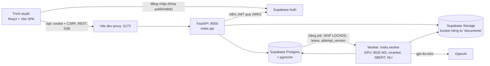

# Bàn giao dự án MSKS

> **MSKS — Multi-Source Knowledge Synthesis:** hệ thống web hỏi đáp và tổng hợp kiến thức đa nguồn có kiểm chứng, xây trên phương pháp EDAHR v11.
> **Ngày bàn giao:** 08/10/2026 · **Người nhận:** team phát triển · **Tài liệu gốc:** [ARCHITECTURE.md](ARCHITECTURE.md) (thiết kế), [REVIEW_2026-10-08.md](REVIEW_2026-10-08.md) (rà soát, lỗi đã sửa, việc còn lại)

---

## 1. Tóm tắt

MVP **hỏi đáp có trích dẫn** đã chạy end-to-end trên Supabase thật:

```text
tải PDF/MD/TXT → nạp nền (parse, chia leaf, embed) → đặt câu hỏi → kết quả stream qua SSE
→ claim đã kiểm chứng bằng NLI → bấm trích dẫn để mở đúng đoạn gốc
```

Kết quả hiện là **bản thử nghiệm**:
- Ngưỡng kiểm chứng chưa được hiệu chỉnh.
- Chưa có benchmark riêng cho MSKS.
- Một migration bảo mật (`0006`) đã viết nhưng **chưa áp dụng**.

Chưa làm: đối chứng chéo, tổng hợp (synthesis), URL/DOI/DOCX/HTML, OCR, xuất DOCX/PDF. Đây là các giai đoạn G3–G4 ở mục 16 của ARCHITECTURE.md.

Ba việc cần làm **trước khi mở cho người dùng thật** (mục 9):
1. Áp dụng và kiểm tra migration `0006`.
2. Bảo vệ endpoint phiên đăng nhập và tách cache theo tài khoản.
3. Đặt trần token/thời gian cho LLM và parser.

---

## 2. Trạng thái tại ngày bàn giao

| Thành phần | Trạng thái | Căn cứ |
|---|---|---|
| Database (Supabase Postgres 17 + pgvector 0.8.2) | Đã áp dụng migration `0001`–`0005`; `0006` **chưa** | `db/migrate.py status` |
| Ràng buộc + RLS | 23/25 đạt. 2 mục chưa đạt cần `0006`: chặn đọc `run_event` thô, ẩn canonical text của nguồn đã xóa | `db/verify_schema.py` (luôn rollback) |
| Backend FastAPI + worker | Chạy được với code hiện tại | `scripts/e2e_smoke.py --pdf` **30/30** trên Supabase + GPU + OpenAI thật |
| Unit test backend | 26/26 (9 cơ bản + 17 hồi quy từ đợt rà soát) | `pytest -q`, không cần mạng/GPU |
| Frontend React + Vite | 28/28 test (mock + jsdom); build và lint đạt; còn cảnh báo bundle ~647 KB | `cd web && npm test && npm run build` |
| Giao diện trên trình duyệt thật | **Chưa kiểm thử thủ công** | Luồng qua proxy Vite chỉ được kiểm bằng script |
| Quản lý mã nguồn | **Chưa có Git**, chưa có CI | Thư mục không phải repository |

---

## 3. Kiến trúc đang chạy



| Process | Lệnh | Ghi chú |
|---|---|---|
| API | `.venv/Scripts/python -m uvicorn msks.api:app --port 8000` | Không nạp model; xác thực, ghi run/job/event trong một transaction rồi trả 202 |
| Worker | `.venv/Scripts/python -m msks.worker` | Một process sở hữu GPU, xử lý tuần tự; lần đầu nạp model mất khoảng 1 phút |
| Frontend | `cd web && npm run dev` | `web/.env.local` đặt `VITE_API_MODE=http`; bỏ biến này đi thì chạy bằng dữ liệu mẫu (mock) |

### 3.1 Luồng nạp nguồn

```mermaid
sequenceDiagram
    participant UI
    participant API
    participant DB as Postgres
    participant ST as Storage
    participant W as Worker
    UI->>API: POST /workspaces/{id}/sources (file, Idempotency-Key)
    API->>API: kiểm MIME thực, ≤ 50 MB
    API->>ST: put workspace/source/revision
    API->>DB: source + document_revision + job(ingest) — 1 transaction
    API-->>UI: 202 Source(status=uploaded)
    W->>DB: nhận job (SKIP LOCKED, lease)
    W->>ST: tải file, kiểm sha256
    W->>W: Docling/MD/TXT → canonical text → cây leaf (edahr)
    W->>DB: parse_revision + node + node_edge, nhóm MinHash
    W->>W: embed BGE-M3 dense+sparse, SBERT
    W->>DB: index_generation(building) → đủ điểm → active; source=ready
    UI->>API: poll GET .../sources (1,5 s khi còn nguồn đang nạp)
```

### 3.2 Luồng hỏi đáp

```mermaid
sequenceDiagram
    participant UI
    participant API
    participant DB as Postgres
    participant W as Worker
    participant L as OpenAI
    UI->>API: POST /workspaces/{id}/qa (Idempotency-Key)
    API->>DB: chốt snapshot nguồn/revision/generation, tạo run + job + event "queued"
    API-->>UI: 202 {run_id, stream_url}
    UI->>API: GET /runs/{id}/stream (SSE, Last-Event-ID)
    W->>DB: classify → ứng viên (≤600 leaf: toàn bộ; lớn hơn: dense+sparse RRF)
    W->>W: Agreement Ranking → đóng gói theo ngân sách (đếm lại token)
    W->>L: prompt grounded, JSON schema citation
    W->>W: verify_visible (NLI trên phần evidence hiển thị)
    W->>DB: context_block + claim + evidence + event claim_verified + done — 1 transaction
    API-->>UI: event theo seq (dựng lại evidence theo tombstone hiện tại)
    UI->>API: GET /runs/{id} khi nhận done (hoặc poll 5 s nếu SSE đứt)
```

---

## 4. Bản đồ mã nguồn

```text
Intership_2/
├── ARCHITECTURE.md · REVIEW_2026-10-08.md · README.md · HANDOFF.md
├── pyproject.toml             # package msks; nhóm [ml] cho worker
├── .env / .env.example        # bí mật backend (không commit)
├── db/
│   ├── migrations/0001…0006   # SQL, có checksum, KHÔNG sửa file đã áp dụng
│   ├── migrate.py             # status | up
│   └── verify_schema.py       # kiểm ràng buộc + RLS trên DB thật, rollback
├── src/
│   ├── edahr/                 # snapshot EDAHR v11 commit b28e650 — KHÔNG sửa
│   └── msks/                  # backend
├── scripts/e2e_smoke.py       # end-to-end trên Supabase thật, tự dọn
├── tests/                     # pytest (conftest dùng cấu hình giả, không đọc .env)
└── web/                       # frontend, xem web/README.md
```

| Muốn sửa… | Bắt đầu từ |
|---|---|
| Endpoint, quyền truy cập, SSE, export | `src/msks/api.py` |
| Đăng nhập, JWT, CSRF | `src/msks/auth.py`, `web/src/auth/` |
| Parse, chia leaf, offset, trang, MinHash | `src/msks/ingest.py` |
| Truy xuất, xếp hạng, đóng gói, prompt, kiểm chứng, chỉ số | `src/msks/qa.py` |
| Vòng đời job, retry, lease, chặn worker cũ | `src/msks/jobs.py`, `src/msks/worker.py` |
| Model và GPU | `src/msks/ml.py` |
| JSON trả cho frontend, che nội dung nguồn đã xóa | `src/msks/dto.py` ↔ `web/src/api/types.ts` |
| Cấu hình, ngưỡng, giới hạn | `src/msks/settings.py` |
| Giao diện một lượt chạy | `web/src/components/run/RunView.tsx` |
| Trình xem nguồn và tô sáng | `web/src/components/viewer.tsx`, `web/src/lib/codepoints.ts` |
| Dữ liệu mẫu và chế độ mock | `web/src/api/mock.ts`, `web/src/api/mockData.ts` |

---

## 5. Bất biến không được phá vỡ

Các quy tắc dưới đây đã có test hoặc ràng buộc DB bảo vệ. Muốn thay đổi thì phải cập nhật ARCHITECTURE.md trước.

1. **Leaf là đơn vị trích dẫn duy nhất.** Mọi claim hiển thị phải có evidence chính gắn `context_block_id`, kiểm chứng trên **phần văn bản thực sự đưa vào context**.
2. **Offset là Unicode code point**, nửa mở `[start, end)`, trỏ vào canonical text của **đúng parse revision**. Python dùng chỉ số trực tiếp; frontend đổi sang UTF-16 qua `CodePointIndex`.
3. **Revision bất biến.** Parse lại thì tạo parse revision mới; embed lại thì tạo index generation mới. Không sửa node mà run cũ đang trích.
4. **Ghi của worker phải được bảo vệ.** Mọi ghi đi qua `jobs.guarded`, kiểm khóa row, `attempt_version`, state và lease còn hạn. Worker cũ thì dừng chứ không ghi.
5. **Lưu trước, phát sau.** Claim/evidence và event `claim_verified` / `done` được ghi trong cùng một transaction. Trước khi publish phải kiểm lại yêu cầu hủy và tombstone.
6. **Nguồn đã xóa.** Tombstone ngay, GC chạy nền. API/SSE/export dựng lại evidence theo tombstone **hiện tại**, không trả lại payload cũ.
7. **Ranh giới bí mật.** Backend chỉ đọc `.env` ở gốc và biến môi trường. Thư mục `web/` chỉ chứa biến `VITE_*` công khai. Không mở rộng `envPrefix` của Vite.
8. **`src/edahr` là snapshot không sửa.** Thay đổi hành vi thì viết trong `src/msks`.
9. **Migration đã áp dụng thì không sửa.** Cần thay đổi thì tạo file mới; `migrate.py` từ chối khi checksum lệch.
10. **Nhãn trung thực.** Dùng "Được bằng chứng hỗ trợ", không nói "đã chứng minh". Không hiển thị điểm NLI như độ chắc chắn của đáp án. Chưa có calibration thì phải gắn nhãn "thử nghiệm".

---

## 6. Thiết lập môi trường

Máy phát triển hiện tại: Windows 11, GPU RTX 4050 6 GB, Python 3.10 hệ thống có sẵn `torch 2.6 + CUDA 12.4`, FlagEmbedding, sentence-transformers và Docling; model đã cache trong `~/.cache/huggingface`. Node 22. Docker **không** cần.

```bash
python -m venv --system-site-packages .venv      # dùng lại torch của hệ thống
.venv/Scripts/pip install -e . --no-deps
.venv/Scripts/pip install "psycopg[binary,pool]>=3.2"
.venv/Scripts/python db/migrate.py status
cd web && npm install
```

Máy mới không có sẵn thư viện ML thì chạy `pip install -e ".[ml]"`. Lần chạy đầu sẽ tải model khoảng 4 GB.

### 6.1 Biến cấu hình (không ghi giá trị ở đây)

| File | Biến | Ghi chú |
|---|---|---|
| `.env` (gốc) | `DATABASE_URL` | Transaction pooler, cổng 6543; tham số `pgbouncer=true` được tự loại |
| | `DIRECT_URL` | Session pooler, cổng 5432 — dùng cho migration |
| | `SUPABASE_URL`, `SUPABASE_SECRET_KEY`, `SUPABASE_PUBLISHABLE_KEY`, `SUPABASE_JWKS_URL` | Secret key chỉ dùng ở backend |
| | `MSKS_LLM_PROVIDER` (`openai`/`none`), `MSKS_LLM_MODEL`, `MSKS_DEVICE`, `MSKS_COOKIE_SECURE`, `MSKS_CORS_ORIGINS`, `MSKS_STORAGE_BUCKET` | Xem `.env.example` |
| | `MSKS_ENABLE_SYNTHESIS`, `MSKS_ENABLE_REMOTE_SOURCES`, `MSKS_ENABLE_CORROBORATION` | Mặc định tắt (MVP) |
| | `MSKS_CALIBRATION_ARTIFACT`, `MSKS_NLI_SUPPORT_THRESHOLD`, `MSKS_NLI_CONTRADICTION_THRESHOLD`, `MSKS_ALLOW_UNCALIBRATED` | Chưa có artifact thì dùng 0,25/0,50 của v11 và gắn nhãn thử nghiệm |
| Biến môi trường hệ thống | `OPENAI_API_KEY` | Mỗi lượt QA tốn vài trăm đến vài nghìn token `gpt-4o-mini` |
| `web/.env.local` | `VITE_API_MODE`, `VITE_SUPABASE_URL`, `VITE_SUPABASE_PUBLISHABLE_KEY` | Chỉ giá trị công khai |
| | `VITE_FEATURE_SYNTHESIS`, `VITE_FEATURE_REMOTE_SOURCES` | Bỏ trống: bật ở mock, tắt ở http |

**Đăng nhập:** Supabase mặc định yêu cầu xác nhận email khi đăng ký. Khi phát triển có thể tạo user qua Admin API (xem `Admin` trong `scripts/e2e_smoke.py`).

---

## 7. Kiểm thử

| Lệnh | Cần gì | Chứng minh được |
|---|---|---|
| `.venv/Scripts/python -m pytest -q` | Không cần gì thêm | Offset/Unicode, phân trang, MinHash, cursor, trạng thái đáp án, chặn worker cũ, hủy trước khi publish, SSE với nguồn đã xóa, idempotency, ngưỡng |
| `cd web && npm test` | Không cần gì thêm | Logic offset, dedup SSE theo `seq`, luồng giao diện trên mock, rerun, phục hồi khi SSE đứt |
| `.venv/Scripts/python db/verify_schema.py` | DB thật | Khóa ngoại liên workspace, CHECK, RLS hai user, tombstone; luôn rollback |
| `.venv/Scripts/python scripts/e2e_smoke.py [--pdf f.pdf]` | API + worker đang chạy, OpenAI | Toàn luồng thật với 2 user tạm; tự xóa user, dữ liệu và file |

**Chưa có test cho:**
- Hai worker tranh cùng một lease trên DB thật.
- Hai request cùng Idempotency-Key gửi đồng thời.
- Đổi tài khoản giữa hai tab, token hết hạn.
- Trình duyệt thật.
- Hiệu năng: độ trễ N1/N2, VRAM, recall của bước sinh ứng viên.
- Chất lượng QA có nhãn người đánh giá.

Đừng tạo PDF thử từ tài liệu cá nhân. `e2e_smoke.py` gửi nội dung lên Supabase và OpenAI. Hãy dùng PDF tự tạo bằng LaTeX như đã làm.

---

## 8. Quyết định đã chốt (ARCHITECTURE.md mục 0.1)

| Thiết kế ban đầu | MVP đang dùng | Xem lại khi |
|---|---|---|
| Qdrant | pgvector, quét chính xác theo generation | Có số đo độ trễ/recall ở khoảng 20.000 leaf mà không đạt |
| Celery + Redis + relay outbox | Bảng `job` trên Postgres (`SKIP LOCKED`, lease, attempt fencing) | Hàng đợi dồn hoặc PDF dài chặn QA: tách queue ingest (CPU) với QA (GPU) trước |
| Lưu file cục bộ / S3 | Supabase Storage riêng tư | Cần nhà cung cấp khác |
| Auth chưa mô tả | Supabase Auth → `POST /api/auth/session` → cookie HttpOnly + `csrf_token` | — |
| Next.js | React + Vite SPA | Có nhu cầu SSR/SEO cụ thể |

Endpoint thêm ngoài bảng mục 10: `/api/auth/session|me`, `GET /api/workspaces`, `GET /api/workspaces/{id}/runs`, `/api/ready`, trường `rerun_of`.

---

## 9. Việc tồn đọng theo ưu tiên

Chi tiết cách tái hiện và gợi ý sửa nằm ở [REVIEW_2026-10-08.md](REVIEW_2026-10-08.md).

### P0 — trước khi có người dùng thật

| # | Việc | Gợi ý |
|---|---|---|
| 1 | Áp dụng migration `0006` lên môi trường kiểm thử, rồi chạy `verify_schema.py` | Mong đợi 25/25; sau đó mới áp dụng lên môi trường dùng chung |
| 2 | Kiểm Origin cho `POST/DELETE /api/auth/session`; bật `MSKS_COOKIE_SECURE` khi có HTTPS | Test đăng nhập/đăng xuất từ origin lạ |
| 3 | Tách cache frontend theo user: clear query/SSE/viewer khi đổi tài khoản hoặc `SIGNED_OUT` từ tab khác | Test 2 tài khoản × 2 tab |
| 4 | Khởi tạo Git, khóa dependency Python, CI chạy pytest + `npm test` + build + lint | Không commit `.env`, `web/.env.local` |

### P1 — trước nghiệm thu

| # | Việc |
|---|---|
| 5 | Đặt trần output token LLM và số cặp NLI cho mỗi run/attempt, tính cả retry |
| 6 | Hard timeout cho Docling và các lời gọi model (process con có giới hạn CPU/RAM/thời gian); hiện chỉ kiểm thời hạn giữa các bước |
| 7 | Heartbeat riêng cho worker để `/api/ready` báo đúng; hiện suy ra từ việc không có job chờ lâu |
| 8 | Reconciler cho blob, parse revision và generation mồ côi; giữ chỗ quota leaf khi chạy nhiều worker |
| 9 | Test tranh chấp trên DB thật: lease, idempotency đồng thời, hủy ngay trước publish |
| 10 | Loader calibration artifact có schema và checksum; hiện chỉ một chuỗi cấu hình là đã được coi là "calibrated" |
| 11 | Benchmark MSKS (mục 14): recall của bước sinh ứng viên, chất lượng QA có nhãn, độ trễ và VRAM |

### P2 — vận hành và mở rộng

| # | Việc |
|---|---|
| 12 | Tách bundle (dynamic import cho Synthesis/Audit/mock); cấu hình production: static host + reverse proxy `/api`, SPA fallback, TLS |
| 13 | Cache reranker/NLI/LLM (mục 12.3); lưu raw LLM response có ACL để replay (hiện chỉ lưu hash) |
| 14 | Quyết định chính sách tiếng Việt: NLI và protocol hiện là tiếng Anh |
| 15 | G3: URL/DOI/HTML/DOCX, review nhóm nguồn, đối chứng chéo. G4: synthesis, xuất DOCX/PDF. Frontend và mock đã có sẵn giao diện sau cờ tính năng |

---

## 10. Sự cố thường gặp

| Hiện tượng | Nguyên nhân / cách xử lý |
|---|---|
| `invalid URI query parameter: "pgbouncer"` | Chuỗi kết nối kiểu Prisma; `db.libpq_url` đã tự loại tham số này. Nếu viết script mới, dùng hàm đó |
| Nguồn đứng ở `uploaded` | Worker chưa chạy hoặc lỗi lúc nạp model; xem log worker. Job bị treo sẽ được nhận lại khi lease hết (120 s) |
| Run báo lỗi config đã đổi | Worker từ chối run khi `config_hash` khác lúc tạo run (tránh ghi provenance sai). Tạo run mới |
| Mọi request 401 ở frontend | Cookie phiên hết hạn (theo hạn của JWT); AuthGate sẽ đổi lại token. Kiểm tra `web/.env.local` có khóa publishable |
| `npm test` hiện màn hình đăng nhập | Vitest đọc `.env.local`; `vite.config.ts` đã ép `VITE_API_MODE=mock` khi test |
| Thiếu VRAM | Worker nạp 4 model fp16 (khoảng 3 GB). Đóng các process GPU khác hoặc đặt `MSKS_DEVICE=cpu` (chậm) |
| Phải đổi code trong `src/edahr` | Đừng sửa: viết lớp bọc trong `src/msks` |

---

## 11. Checklist ngày đầu cho người nhận

- [ ] Đọc mục 0, 0.1, 5.4, 7.2 và 8.1 của ARCHITECTURE.md, cùng REVIEW_2026-10-08.md.
- [ ] Nhận quyền vào dự án Supabase và tự tạo `.env` theo `.env.example`. Không chép file `.env` qua chat.
- [ ] Chạy `pytest -q`, `npm test`, `db/migrate.py status` và đối chiếu với mục 2.
- [ ] Bật 3 process, đăng nhập bằng user thử, tải một file Markdown, đặt một câu hỏi, bấm trích dẫn.
- [ ] Chạy `scripts/e2e_smoke.py` một lần để xác nhận môi trường của mình.
- [ ] Nhận việc P0 ở mục 9 và tạo repository Git trước khi sửa code.
