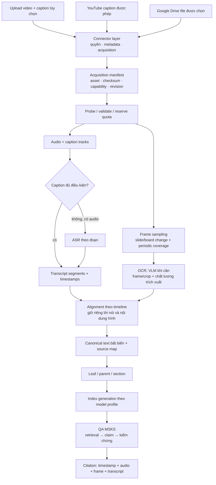

# Kiến trúc bài giảng video và kiểm chứng tiếng Việt

> **Phiên bản:** 0.2 — 2026-10-09.
> **Trạng thái:** Backend L0–L1 đã triển khai, L2 một phần (YouTube với phụ đề do người dùng cung cấp), L3–L4 chưa. Frontend chưa có giao diện bài giảng. Profile tiếng Việt **chưa hiệu chỉnh** — kết quả là thử nghiệm. Xem [mục 13](#13-trạng-thái-triển-khai-09102026).
> **Liên kết:** [Kiến trúc MSKS](ARCHITECTURE.md), [các vấn đề nền tảng cần xử lý](REVIEW_2026-10-08.md).

## 1. Quyết định kiến trúc

**Thêm nguồn là mở rộng connector và chuẩn hóa dữ liệu; chưa cần tự huấn luyện model.** Giữ React/Vite, FastAPI, PostgreSQL/pgvector và Storage của MSKS. Bổ sung xử lý media trước canonical text, sau đó tái sử dụng leaf → retrieval → generation → verification.

| Quyết định | Phương án đề xuất |
|---|---|
| Thứ tự nguồn | Video tải lên → YouTube có phụ đề được phép truy cập → Google Drive → extension Zoom/LMS |
| MVP bài giảng | Video ghi sẵn, tiếng Việt/Anh; transcript có thời gian, khung slide/bảng được chọn, QA có citation thời gian |
| Ngoài MVP | Livestream, extension bắt màn hình, diarization nâng cao, nhận diện người, tự fine-tune, bảo đảm đọc mọi chữ viết tay/công thức |
| Connector | Xác định nguồn, kiểm tra quyền, nhận file/caption và metadata; không chứa logic ASR/OCR/NLI |
| Pipeline media | Probe → âm thanh/phụ đề và khung hình → ASR/OCR → alignment → canonical revision |
| Kiểm chứng | NLI trên văn bản được trích; chất lượng chuyển âm thanh/hình thành chữ là một lớp đánh giá riêng |
| Lưu trữ mặc định đề xuất | Video gốc lưu tạm; âm thanh bằng chứng + frame/crop + caption/transcript giữ theo vòng đời source; có tùy chọn giữ video gốc |
| Model tiếng Việt | Profile mới `lecture_vi_v1`, model có sẵn, hiệu chỉnh/đánh giá riêng; không sửa profile `v11_parity` |

“Cùng pipeline” là cùng hợp đồng và bộ điều phối, không có nghĩa mọi nguồn phải chạy đủ mọi bước. Caption hợp lệ có thể bỏ ASR; nguồn chỉ có caption không có nhánh hình; thiếu một modality phải thể hiện rõ ở coverage.

## 2. Sơ đồ luồng chung

Connector trả **manifest**, không bắt buộc trả một video file. Manifest nêu rõ khả năng `audio_available`, `visual_available`, `captions_available`, `original_playback_available`. Ví dụ YouTube chỉ có caption hợp lệ vẫn đi qua pipeline transcript nhưng không được ghi “đã phân tích bảng”.

## 3. Connector và quyền truy cập

| Connector | Đầu vào và acquisition | Fallback / giới hạn |
|---|---|---|
| Upload | Upload resumable vào staging private; caption SRT/VTT đính kèm tùy chọn; complete rồi mới probe | MVP nhận MP4/WebM được probe hợp lệ; file audio đơn lẻ có thể thêm sau qua cùng pipeline |
| YouTube | Chuẩn hóa video ID; OAuth khi cần; lấy track được phép, lưu caption bytes/locale/loại track/version snapshot | Không lấy được caption → yêu cầu người dùng cung cấp SRT/VTT hoặc file được phép; không tự chuyển sang tải video bất kỳ |
| Drive | Chuẩn hóa file ID/resource key khi có; metadata/capabilities → tải blob video bằng Drive API | Không có quyền, file không phải video hoặc download bị chặn → báo lỗi connector; không scrape trang xác nhận tải |
| Zoom/LMS | Trong các giai đoạn đầu: file do người dùng export rồi upload | Extension sau cùng tạo cùng manifest + timeline; cần quyền capture rõ ràng, không mặc định bắt mọi tab |

**YouTube:** API `captions.download` yêu cầu quyền chỉnh sửa video; video công khai có phụ đề không đồng nghĩa ứng dụng được tải phụ đề qua API. Chỉ nhận track mà luồng quyền thực sự cho phép hoặc caption do người dùng cung cấp. Caption-only không cung cấp khung bảng, audio hay bằng chứng hình. Nhúng player/link timestamp là khả năng riêng, phụ thuộc nguồn còn truy cập được. [YouTube Captions: download](https://developers.google.com/youtube/v3/docs/captions/download)

**Drive:** dùng metadata để kiểm tra khả năng tải (`capabilities.canDownload`); blob file được tải qua cơ chế Drive API, không coi mọi URL chia sẻ là file tải trực tiếp. Thiết kế ưu tiên OAuth cho từng file người dùng chọn; lựa chọn scope tối thiểu phải phù hợp luồng Picker/file selection. Link công khai vẫn đi qua kiểm tra quyền/capability thực tế. [Drive downloads](https://developers.google.com/workspace/drive/api/guides/manage-downloads), [Drive OAuth scopes](https://developers.google.com/workspace/drive/api/guides/api-specific-auth)

Thông tin cấp quyền tải không chứng minh tính đúng của bài giảng. Lưu `acquisition_basis`, provider/file ID, thời điểm nhận và nguồn cấp caption; không đưa access/refresh token vào manifest, log hoặc prompt. OAuth của connector là kết nối riêng, không đồng nhất với phiên đăng nhập MSKS.

## 4. Upload lớn và vòng đời asset

### 4.1 Upload theo phiên

1. UI gửi metadata dự kiến: tên, kích thước, loại nguồn, lựa chọn lưu video gốc và caption đi kèm.
2. API xác thực workspace, reserve quota byte/thời lượng dự kiến và tạo upload session gắn đúng object key do server sinh.
3. Browser tải resumable trực tiếp vào vùng staging private; API không giữ toàn bộ video trong RAM hoặc request multipart dài.
4. Complete endpoint xác minh object key/owner, kích thước thực và trạng thái hoàn tất; worker tính checksum, probe stream/duration/codec rồi quyết định nhận xử lý.
5. Quota được điều chỉnh theo duration/decoded size thực; file không đạt bị từ chối trước ASR/OCR. Session hết hạn/abandoned có GC riêng.

Supabase có TUS resumable upload; vẫn phải kiểm tra giới hạn global/bucket/gói dịch vụ trước khi chọn mức upload. Không tăng limit bucket tài liệu 50 MB để nhận tất cả loại dữ liệu; thiết kế bucket hoặc policy media riêng. [Supabase resumable upload](https://supabase.com/docs/guides/storage/uploads/resumable-uploads), [Storage limits](https://supabase.com/docs/guides/storage/uploads/file-limits)

**Không cam kết tách audio ngay khi byte đầu tiên tới.** MVP hoàn tất file staging rồi mới xử lý; khả năng đọc khi đang upload tùy container và metadata/khả năng seek. Việc tách ngay lúc upload không loại bỏ nhu cầu lưu tạm hay quota mạng. Nếu sau này thêm streaming extraction, đó là một tối ưu có fallback, không phải điều kiện để upload thành công.

### 4.2 Chính sách giữ/xóa đề xuất

| Asset | Chính sách |
|---|---|
| Video gốc staging | Private; giữ tới khi extraction, checksum và publish thành công; đề xuất grace 24 giờ sau READY nếu chọn chế độ tiết kiệm |
| Audio làm bằng chứng | Lưu audio đã chuẩn hóa, ưu tiên nén lossless cho nhánh bằng chứng; codec/rate/channel và timeline transform có version |
| Frame/crop | Giữ frame được dùng làm bằng chứng và crop liên quan ở chất lượng đủ đọc; không chỉ giữ OCR text |
| Caption/transcript/OCR | Giữ raw output, bản được chọn và revision chỉnh sửa; không ghi đè chứng cứ cũ |
| Proxy video | Tùy chọn, người dùng chọn lưu để có trải nghiệm xem video; không hứa giống byte gốc |
| Extraction lỗi/partial | Giữ file trong TTL phục hồi đề xuất 7 ngày rồi đánh dấu EXPIRED/thu gom; không dùng luồng READY để xóa sớm |

Các TTL trên là mặc định thiết kế cần công bố trên UI, chưa áp dụng lên storage. “Xóa staging sau xử lý” không đồng nghĩa xóa nguồn: source vẫn giữ derivatives đã chọn. **Xóa source** phải tombstone ngay rồi thu gom staging, audio, frame, crop, caption, OCR, canonical text, vector, cache và nội dung audit/event theo chính sách đã định; backup có thời hạn riêng.

Nếu bỏ video gốc, viewer chỉ phát audio và hiển thị các frame đã giữ. Không thể lấy lại frame bị bỏ lỡ, tái phân tích toàn bộ video hay bảo đảm link YouTube/Drive còn tồn tại. Cần upload lại để thay thuật toán chọn frame. Checksum video gốc chứng minh định danh byte đã nhận, không thay thế việc giữ bytes.

## 5. Pipeline trích xuất chung

### 5.1 Probe và timeline

- Probe duration, số stream, time base/start time, frame rate, resolution, codec, audio track và language metadata; xử lý sandbox có giới hạn CPU/RAM/disk/time.
- Mốc chuẩn là thời gian trình chiếu của revision media; API dùng millisecond nguyên, khoảng nửa mở `[start_ms, end_ms)`. Frame có `timestamp_ms` riêng. Giữ timestamp/time base gốc và phép đổi sang timeline chuẩn để kiểm toán.
- Khi resample, cắt im lặng hoặc chia clip, giữ map clip-time → source-time; không ghép các đoạn rồi mất khoảng trống. Video VFR không dùng chỉ số frame chia FPS giả định. FFmpeg có ngữ nghĩa timestamp riêng cho stream/frame; adapter phải kiểm tra mapping sau chuyển đổi. [FFmpeg documentation](https://ffmpeg.org/ffmpeg.html)
- Track phụ đề lệch thời gian được gắn `alignment_uncertain`; không tự cho là chính xác chỉ vì parse được SRT/VTT. Phụ đề không có timing chỉ được nhận như transcript chưa căn chỉnh hoặc phải qua alignment riêng.

### 5.2 Caption và ASR

Ưu tiên track đúng ngôn ngữ, có thời gian hợp lệ và độ phủ phù hợp. Phân biệt caption người soạn, auto-caption và transcript ASR; track được chọn có `selection_reason`. Nếu chỉ có caption thì chất lượng âm thanh không kiểm tra được, UI ghi rõ phạm vi này.

Nếu có audio mà không có caption phù hợp: chọn speech segments, ASR theo chunk có overlap nhỏ, khử câu lặp ở biên và đổi timestamp về timeline chuẩn. Lưu đoạn im lặng/không nhận dạng được như khoảng thiếu dữ liệu; không để model điền nội dung tưởng tượng. Chỉ chạy ASR bù đoạn thiếu nếu có mapping đủ chắc; không trộn hai transcript mà không ghi nguồn từng đoạn.

Chuẩn bị glossary tên riêng/thuật ngữ để adapter dùng khi backend ASR hỗ trợ contextual prompting; so với baseline không glossary vì gợi ý sai cũng có thể làm lệch phiên âm. Không giả định mọi checkpoint/adapter PhoWhisper có cùng hỗ trợ prompt hoặc word timestamps. Nếu cần word alignment, đó là bước riêng có version và sai số; MVP ưu tiên timestamp theo segment.

### 5.3 Khung hình và OCR/VLM

- Chọn frame khi slide/board thay đổi kết hợp kiểm tra định kỳ để không bỏ qua bảng viết tăng dần. Khử gần trùng để giảm OCR, nhưng lưu các khoảng frame đó xuất hiện; chữ/công thức thay đổi nhỏ vẫn có thể là thay đổi quan trọng.
- OCR trên vùng slide/bảng ở độ phân giải phù hợp; giữ ảnh trước xử lý và phép resize/crop/rotation. Mỗi vùng có bbox, frame ID, raw text và quality flags.
- VLM dùng cho vùng khó hoặc mô tả cấu trúc hình, với output có region reference và khả năng trả “không đọc được”. Không cho VLM tự sửa phương trình/số liệu rồi coi đó là chữ gốc. Mô tả sinh thêm ban đầu chỉ dùng gợi ý retrieval, chưa làm evidence cho claim nếu chưa qua policy đánh giá riêng hoặc review.
- OCR/VLM tạo caption của ảnh không tự kiểm chứng được nội dung ảnh. Trường hợp chữ viết tay, dấu âm, số mũ, chỉ số và công thức không chắc: giữ crop và yêu cầu xem lại/abstain.

### 5.4 Alignment và canonical text

Ghép lời nói và vùng bảng theo overlap thời gian, khoảng hiệu lực của slide và section/chủ đề. Gần nhau về thời gian chỉ tạo **quan hệ alignment**, không đủ kết luận hai đoạn mô tả cùng một sự kiện. Giữ độ chắc chắn và lý do liên kết; lời nói và bảng mâu thuẫn không được hợp nhất thành một câu “đã sửa”.

Canonical text serialize riêng các block `speech`, `caption`, `board_text`, có thứ tự ổn định. Không dùng LLM viết lại toàn bộ thành văn xuôi trước index vì làm mất provenance. Metadata/timestamp có thể xuất hiện trong header truy xuất; phần lời gốc/OCR dùng cho NLI phải tách khỏi header.

Leaf ưu tiên nằm trong một modality, không cắt ngang segment/công thức nếu có thể; thời lượng chỉ là giới hạn mềm, tokenizer mới quyết định giới hạn model. Leaf dài tách ở câu/block với map đầy đủ; không gộp cả giờ thành một leaf. Alignment nối các leaf liên quan để truy xuất bổ sung hoặc tạo evidence bundle sau này.

## 6. Mô hình dữ liệu và provenance

Đây là mô hình logic cần bổ sung, **không phải SQL migration**. Giữ `source → document_revision → parse_revision → node` của MSKS; một bài giảng upload, bản YouTube và bản Drive có thể thuộc cùng tác phẩm/nhóm nguồn gốc.

| Thực thể | Trường/hợp đồng chính |
|---|---|
| `acquisition` | workspace/source, connector, provider ID, provider revision/etag khi có, quyền nhận, thời điểm, trạng thái, manifest hash |
| `upload_session` | owner/workspace, object key, expected/actual bytes, reserved quota, expiry, trạng thái finalize |
| `media_asset` | document revision, loại original/audio/frame/crop/caption, object key, checksum, parent asset, codec/geometry, retention và trạng thái ready/deleted |
| `extraction_revision` | input asset hashes, model/runtime/prompt/glossary/sampler versions, coverage, status; liên kết parse revision tạo từ output này |
| `transcript_segment` | extraction revision, track, text, language, start/end ms, origin human-caption/auto-caption/ASR/manual-edit, quality flags, audio locator nếu có |
| `frame_region` | frame asset, timestamp, bbox hệ tọa độ pixel gốc, crop transform, observation/visibility interval, OCR/VLM text, method và review state |
| `alignment_edge` | segment ↔ frame region, temporal relation, score/uncertainty, policy version; không phải evidence support edge |
| `source_map_span` | parse revision + canonical start/end code point → segment/region, khoảng ký tự trong segment, asset/time/bbox, mapping precision |
| `claim_evidence` mở rộng | leaf và visible quote như cũ, kèm locator đã snapshot, modality, extraction revision, transcription quality state và verification method |
| `model_profile` | language/task, embedding/reranker/SBERT/NLI IDs và revisions, dimension, normalization, tokenizer, thresholds và calibration digest |

Bất biến:

1. Mọi quan hệ kiểm tra cùng workspace; locator không được trỏ sang asset của workspace khác. Blob private, URL xem có hạn và cấp sau kiểm tra quyền/tombstone.
2. Một đoạn canonical có thể map nhiều segment hoặc nhiều frame; không ép về một bbox hay một khoảng thời gian liên tục. Quan hệ nhiều-nhiều nằm trong source map, không nén mất chi tiết vào `node.page_start`.
3. Video không có số trang: `page=null`. `char_*` vẫn là Unicode code point; `start_ms/end_ms` là tọa độ khác. Độ chính xác segment không được trình bày như word-level alignment.
4. Sửa transcript/OCR hoặc đổi model tạo revision mới, index generation mới; run cũ giữ revision và locator cũ. Ngưỡng/model đổi phải đi cùng profile version.
5. Transcript và bảng của cùng bài giảng là **hai modality của một nguồn**, không phải hai nguồn độc lập. Upload/YouTube/Drive của cùng bài cũng không tự tạo nhãn CORROBORATED.
6. Nguồn bị xóa thì mọi đường đọc locator, media streaming, thumbnail, audit, export và replay đều phải chặn. Signed URL đã cấp có cửa sổ hết hạn; không hứa thu hồi tức thời URL đó nếu storage không hỗ trợ.

Ví dụ citation người dùng: **[S2 · 12:34–12:46 · lời giảng]** mở transcript đúng revision và đoạn audio tương ứng. **[S2 · 12:39 · bảng]** mở frame/crop. Nếu một câu cần cả hai, lưu hai evidence links; không diễn giải link cùng thời gian là tự chứng minh claim.

## 7. Model tiếng Việt và chính sách kiểm chứng

| Thành phần | Hướng chọn ban đầu | Điều kiện trước bật chính thức |
|---|---|---|
| ASR | So Whisper đa ngôn ngữ với PhoWhisper có sẵn; thử glossary nếu adapter hỗ trợ | WER/CER, thuật ngữ/số liệu, sai timestamp và thời gian xử lý trên bài giảng thực |
| Dense/sparse + reranker | Giữ BGE-M3/bge-reranker-v2-m3 làm ứng viên kế thừa | Đo recall/ranking trên query tiếng Việt, code-switch và transcript có lỗi |
| Similarity cho Agreement | Thử `sentence-transformers/paraphrase-multilingual-mpnet-base-v2` so với nhánh cross-encoder-only | Không mặc định model paraphrase tối ưu cho query→passage; đo đúng truy xuất QA |
| NLI | Thử `MoritzLaurer/mDeBERTa-v3-base-mnli-xnli` | Calibration tiếng Việt, ngữ cảnh bài giảng, phủ định/số/công thức; đọc label mapping từ config |
| OCR/VLM | Adapter có sẵn; chọn checkpoint sau tập mẫu slide/bảng và profiling máy đích | Đo ký tự/công thức và khả năng từ chối khi không đọc được |

PhoWhisper là bộ model ASR tiếng Việt đã fine-tune sẵn; dùng checkpoint không đồng nghĩa dự án phải tự train. SBERT đa ngôn ngữ và mDeBERTa là **ứng viên đánh giá**, không phải kết luận đã đạt chất lượng trên dữ liệu của MSKS. [PhoWhisper](https://github.com/VinAIResearch/PhoWhisper), [SBERT model card](https://huggingface.co/sentence-transformers/paraphrase-multilingual-mpnet-base-v2), [NLI model card](https://huggingface.co/MoritzLaurer/mDeBERTa-v3-base-mnli-xnli)

**Không trộn embedding từ model/revision khác trong cùng phép so cosine**, kể cả cùng dimension. `lecture_vi_v1` phải encode cả query và leaf cùng profile. Thay SBERT cần re-embed similarity vectors theo generation; thay NLI cần calibration/version mới nhưng không tự bắt buộc re-embed dense. Không sửa index lịch sử tại chỗ.

Khi QA trộn PDF tiếng Anh với bài giảng tiếng Việt, ban đầu yêu cầu toàn scope có generation tương thích với profile đa ngôn ngữ được chọn; nguồn chưa có thì reindex hoặc báo chưa sẵn sàng. Không trộn điểm chưa hiệu chỉnh từ hai profile để xếp hạng toàn kho. Benchmark đa ngôn ngữ tách khỏi parity v11.

Hai lớp đánh giá không thay thế nhau:

- **Chất lượng trích xuất:** ASR/OCR/caption có chép đúng điều đã nói/hiển thị không? Giữ uncertainty, coverage và evidence gốc. Điểm confidence giữa các model không mặc nhiên cùng thang.
- **Hỗ trợ claim:** văn bản evidence thực sự hiển thị có hỗ trợ đúng claim không? NLI premise=evidence, hypothesis=claim. Không đọc phần transcript/OCR ẩn ngoài context.

NLI có thể chấp nhận claim dựa trên một từ/số ASR chép sai. Vì vậy UI ghi **“Được bản chép tự động hỗ trợ”** nếu chưa được người kiểm tra đối chiếu media; chỉ thêm nhãn “Đã đối chiếu âm thanh/hình ảnh” khi có review hoặc quy trình media-verification đã đánh giá riêng. Không gọi text NLI là kiểm chứng trực tiếp video. Đoạn bị cảnh báo trích xuất quan trọng không được auto-publish claim số liệu/công thức; cho xem bản chép để sửa hoặc từ chối trả lời.

Chưa tự fine-tune trong kế hoạch này. Chỉ mở nhánh train nếu đã có benchmark holdout cho thấy model sẵn có + glossary + preprocessing vẫn chưa đạt, và có dữ liệu được phép sử dụng/gán nhãn. Train không thay connector, alignment hay source map.

## 8. Job, scheduling và giới hạn tài nguyên

Pipeline là DAG có checkpoint: `ACQUIRE → PROBE → EXTRACT → TRANSCRIBE/VISUAL_READ → ALIGN → BUILD_CANONICAL → EMBED → PUBLISH`. Hai nhánh có thể chạy độc lập về logic; trên một GPU vẫn cần scheduler để không cùng nạp ASR/VLM/NLI vượt VRAM.

| Hàng việc logic | Tải và chính sách |
|---|---|
| `acquire` | I/O; deadline/byte cap; không giữ DB transaction trong suốt tải file |
| `media_cpu` | Probe, decode, frame selection; process sandbox có quota |
| `asr_visual` | GPU batch có trần theo đoạn; nhường ở ranh giới chunk cho QA; không hứa preempt giữa một kernel/model call |
| `qa` | Ưu tiên tương tác; giới hạn concurrent run và NLI pairs |
| `publish_gc` | Commit generation, reconcile, xóa; không nằm sau toàn bộ hàng ASR dài |

Tiếp tục dùng bảng job PostgreSQL; chưa cần thêm broker chỉ vì có video. Dùng stage/task key gồm input revision hash + profile/config hash + phạm vi chunk; re-delivery không tạo artifact publish trùng. Stage output thành công được tái sử dụng; retry riêng ASR chunk lỗi, không tải và xử lý lại cả giờ.

Mỗi publication kiểm tra lease/attempt, cancel và tombstone trước commit. Readiness báo riêng worker media, GPU profile và connector; progress có bytes đã nhận, media time đã xử lý, số vùng đã đọc, không bịa ETA khi chưa có throughput thực đo.

Giá trị khởi đầu **đề xuất để profiling**, không phải cấu hình đã bật: tối đa 60 phút/video, 2 GiB raw/file, một media job GPU tại một thời điểm, kiểm tra frame định kỳ khoảng 5 giây kèm scene/board changes, tối đa 1.000 frame chuyển OCR/VLM mỗi giờ. Số byte, duration, pixel decode, frame count và token VLM là các quota riêng; file nhỏ vẫn có thể quá dài hoặc tốn decode. Phải xác nhận hạn mức Storage trước khi nhận 2 GiB; nếu không đáp ứng thì hạ mức UI và API cùng lúc.

Hết budget frame không được im lặng bỏ phần cuối: job báo `visual_incomplete`, coverage ghi khoảng chưa xử lý. Source có thể READY với audio/caption-only theo capability, nhưng QA hình phải báo thiếu evidence. Stage bắt buộc lỗi → FAILED; thiếu nhánh tùy chọn → READY_LIMITED; thiếu chất lượng cần người dùng → REVIEW_REQUIRED. Đây là trạng thái **đề xuất mới**, phải ánh xạ DTO/schema trước khi triển khai, không tái sử dụng `ready` như thể đã đọc đủ video.

## 9. API và giao diện dự kiến

Các route dưới đây là hợp đồng thiết kế; chưa tạo endpoint:

| Route/chức năng | Hành vi |
|---|---|
| Tạo `media-upload-session` trong workspace | Reserve quota, trả upload ID và thông tin resumable gắn object key |
| Complete/cancel upload session | Xác minh metadata/object; complete idempotent trả source/job IDs; cancel thu hồi session và staging |
| Tạo source từ YouTube/Drive | Body có discriminator và connection/file/video ID; kiểm tra quyền từ server, không tin client khai đã được cấp |
| Kết nối/ngắt Google OAuth | State/PKCE, scope tối thiểu theo luồng, token lưu mã hóa server; disconnect chặn acquisition mới |
| Đọc source capabilities/progress | Phân biệt đã đọc lời nói, đã đọc hình, thiếu đoạn, hết budget và cần review |
| Đọc media locator của citation | Kiểm tra workspace/source revision/tombstone; trả signed URL ngắn hạn hoặc stream có kiểm tra Range |
| Sửa transcript/region | Tạo extraction/parse revision mới, tác vụ reindex; xem lịch sử, không overwrite run cũ |

UI cần ba vùng: player audio/video tùy asset, transcript có timestamp và slide/bảng theo timeline. Citation click seek thời gian và tô sáng quote hoặc crop. Với timestamp segment chỉ tô vùng segment tương ứng; không giả lập độ chính xác từng từ. Caption-only hiển thị caption snapshot + external player/link nếu khả dụng, không hiện nút phát audio nội bộ không tồn tại.

Trước nhập nguồn, UI nêu modality có thể nhận, thời lượng/dung lượng, lựa chọn giữ video và model chạy local/ngoài dịch vụ. Sau xử lý hiển thị coverage thiếu và chất lượng trích xuất. Người dùng biết vì sao câu hỏi về bảng không trả lời được dù transcript có nhiều chữ.

## 10. An toàn acquisition và dữ liệu

- URL remote đi qua connector allowlist, kiểm DNS/IP đích tại kết nối và từng redirect; chặn private/loopback/link-local IPv4/IPv6. Link/file ID không được nội suy thành lệnh shell.
- Fetcher tải bytes vào staging; media processor dùng file local, không tự đọc URL playlist/network bất kỳ. Chặn protocol/network access ngoài nhu cầu của decoder, có quota disk, process và timeout.
- OAuth token chỉ dùng với API provider tương ứng; không chuyển Authorization sang redirect host khác. Disconnect/revoke không tự xác định chính sách giữ snapshot cũ: UI có lựa chọn xóa dữ liệu đã nhập, và vẫn kiểm ACL MSKS cho nội dung đã lưu.
- Text từ caption, chữ trong hình và transcript đều là dữ liệu không tin cậy; không được chỉ đạo gọi tool, truy cập secret hay sửa policy kiểm chứng.
- Không tự tải video bằng cơ chế vượt quyền. Khi thiếu quyền caption/media, connector trả trạng thái cụ thể và cho phép người dùng cung cấp bản họ được phép sử dụng.

## 11. Đánh giá và cổng nghiệm thu

Tách calibration/test theo bài giảng, giảng viên/khóa học và bản sao; không để audio/transcript/crop của cùng bài nằm ở cả hai tập. Tập mẫu gồm giọng vùng miền, tiếng Việt lẫn thuật ngữ Anh, im lặng, tiếng ồn, bảng viết dần, slide đổi nhanh và âm thanh/hình mâu thuẫn.

| Lớp | Đo gì | Điều kiện mở tính năng |
|---|---|---|
| Acquisition | Resume, duplicate complete, file lớn/sai MIME, quyền hết hạn, xóa khi đang tải | Không lộ workspace/token; giới hạn thực được enforce; quyền thiếu có fallback rõ |
| ASR/caption | WER/CER, thuật ngữ/số, thiếu/nhân đôi đoạn, offset p50/p95 | So model/track trên dữ liệu gán nhãn; có báo cáo lỗi riêng cho số/công thức |
| Visual | Recall nội dung quan trọng, OCR CER, công thức, false transcription | Không lấy OCR text làm nhãn chuẩn của chính OCR; chấm đối chiếu frame |
| Alignment | Ghép đúng câu–slide/bảng, sai số thời gian, vùng trống | Không coi temporal proximity là ground truth; kiểm cả VFR và caption lệch |
| Citation | Exact canonical span, revision, asset/time/bbox round-trip | 100% fixture truy vết đúng hoặc fallback ghi rõ; không có citation tự bịa asset |
| QA tiếng Việt | Citation precision, answer correctness/coverage, abstention; đánh giá conditional-on-transcript và end-to-end riêng | Đăng ký ngưỡng trước test; kế thừa mục tiêu precision/coverage của MSKS như mục tiêu cần đo, không coi đã đạt |
| Vận hành | Giây xử lý/phút media, peak VRAM, storage/phút, token/cost, queue wait QA | Chạy ca dài nhất và tranh chấp tải; demo một clip ngắn chưa chứng minh xử lý được một giờ |

Ablation tối thiểu: caption/ASR-only so với thêm OCR; OCR so với OCR+VLM; frame định kỳ so với sampling thích ứng; Agreement đa ngôn ngữ so với cross-encoder-only. Chỉ mở thành phần khi lợi ích đo được và chi phí chấp nhận được.

## 12. Lộ trình thiết kế sang triển khai

| Mốc | Phạm vi | Cổng hoàn thành |
|---|---|---|
| L0 — Nền tảng | Chốt media/provenance/profile contract, quota, worker fencing, deletion, auth và budget còn thiếu | Fixture source map/time + protocol đánh giá; xác minh storage/GPU/model thực tế |
| L1 — Video upload | Resumable + audio/timestamp trước; frame/OCR thêm vào cùng connector sau đó; viewer evidence | QA bài giảng tải lên, citation mở đúng audio/frame; chưa bật tiếng Việt chính thức nếu NLI chưa đạt gate |
| L2 — YouTube caption | Track được phép hoặc SRT/VTT người dùng cung cấp; reuse transcript pipeline | Nguồn caption-only có nhãn; 403/mất quyền/không track được xử lý; không phụ thuộc tải video tùy ý |
| L3 — Drive | File selection/OAuth, download metadata snapshot → cùng pipeline L1 | File private/public đủ quyền, revoke, thay revision, quota/resume đều được kiểm tra |
| L4 — Extension | Capture có đồng ý cho Zoom/LMS, timeline origin và manifest chung | Quyền capture rõ, khôi phục phiên/mất tab, không trùng đoạn; làm sau khi ingestion upload ổn định |

Việc đánh giá profile tiếng Việt diễn ra trong L0–L1, trước nhãn hỗ trợ claim tiếng Việt; không chờ tới khi connector YouTube/Drive hoàn tất. Tự train là nhánh nghiên cứu có điều kiện sau các mốc này, không phải dependency.

Chưa xác minh trong lần thiết kế: ffmpeg/model nào đã có trên máy, hạn mức Supabase thực tế, quyền OAuth của ứng dụng, thời hạn thực tập và tập bài giảng mẫu. Các lựa chọn phần cứng, checkpoint VLM và SLO cuối cùng chỉ chốt sau profiling, không dựa vào nhận định “đã cache” hoặc “GPU đủ” chưa kiểm tra.

## 13. Trạng thái triển khai (09/10/2026)

### 13.1 Đã có

| Mốc | Thành phần | Mã |
|---|---|---|
| L0 | Profile `product` / `lecture_vi_v1` (SBERT `paraphrase-multilingual-mpnet-base-v2`, NLI `mDeBERTa-v3-base-mnli-xnli`); generation active theo từng profile; run chọn profile theo phạm vi, nguồn thiếu generation → `422 profile_index_missing` + reindex | `profiles.py`, `indexing.py`, `api.py` |
| L0 | Schema mục 6: upload session, acquisition, media asset, extraction revision, transcript segment, frame region, alignment edge, source map; trạng thái `ready_limited` / `review_required` | `db/migrations/0007`, `0008` |
| L1 | Upload theo phiên, nhiều phần, resume, idempotent, quota workspace, caption SRT/VTT đính kèm, hủy phiên, GC phiên hết hạn | `api_media.py` |
| L1 | Probe → âm thanh FLAC 16 kHz theo đoạn 10 phút + WAV cho ASR → frame theo timestamp thực → caption hoặc ASR (faster-whisper, VAD) → OCR → alignment → canonical + source map → index | `media/*.py` |
| L1 | Citation có `locator` (segment/region, ms, asset, bbox), `modality`, `transcription_state`; `support_basis = automatic_transcript` cho UI ghi “Được bản chép tự động hỗ trợ” | `qa.py`, `dto.py` |
| L1 | Claim có số/công thức dựa trên đoạn bị cảnh báo chất lượng và chưa đối chiếu → loại với lý do `extraction_quality_review_required` | `qa.extraction_needs_review` |
| L1 | Timeline API, URL media hạn 300 s sau kiểm quyền + tombstone, sửa transcript/vùng chữ → revision mới (run cũ giữ revision cũ), xóa nguồn → GC audio/frame/video gốc + che bản chép | `api_media.py`, `media/pipeline.py` |
| L2 | YouTube: chuẩn hóa video ID, chỉ nhận phụ đề người dùng cung cấp, nguồn `ready_limited` không có hình; thiếu phụ đề → `501 youtube_oauth_not_configured` | `api_media.add_youtube` |
| L3 | Drive → `501 drive_oauth_not_configured` (chưa có OAuth client) | |

### 13.2 Phát hiện khi đo trên máy dev

| Phát hiện | Quyết định |
|---|---|
| Supabase của dự án từ chối tạo bucket cho phép file > 50 MB (gói hiện tại) | Upload **nhiều phần** ≤ 45 MB qua signed URL, worker ghép và kiểm checksum; âm thanh lưu theo đoạn 10 phút. Mặc định tối đa 400 MB/video, 800 MB media/workspace (gói Free 1 GB tổng) — chỉnh khi nâng gói |
| RapidOCR (PP-OCRv6 mặc định) **bỏ dấu tiếng Việt** (“với” → “vi”) nhưng báo độ tin 0,97–0,99 | Mặc định **EasyOCR** (vi+en), đọc đúng dấu, độ tin 0,70–0,80; ngưỡng tin cậy theo engine. Lỗi còn gặp: “lập” → “Iập” |
| Trung bình độ lệch ảnh không phát hiện slide nền trắng đổi chữ (chỉ chọn 1/4 slide) | Chỉ số mới: tỉ lệ điểm ảnh đổi > 12 % độ sáng trên ảnh 320×180, ngưỡng 0,2 % |
| Bộ lọc `fps` gán timestamp theo chỉ số → lệch tới một khoảng lấy mẫu | Lấy frame bằng `select` + đọc `pts_time` thực qua `showinfo` |
| Xóa cascade cả workspace thất bại do khóa ngoại media kiểm tra quá sớm | Migration `0008`: khóa ngoại DEFERRED; `verify_schema.py` có ca tái hiện |
| Video mẫu 36 s (tạo bằng `scripts/make_sample_lecture.py`): xử lý ~96 s lần chạy có model đã nạp | Chưa phải số đo hiệu năng: cần profiling với bài giảng thật dài 60 phút |
| ASR tiếng Việt, FLEURS dev 120 câu (chi tiết: `analysis/vi_lecture_eval.md`): turbo WER 7,8 %, RTF 0,09; PhoWhisper-large 5,5 % (KTC 95 % của chênh lệch [1,35; 3,14] điểm), RTF 0,33 sau khi chuyển CT2 | **Giữ turbo**, không đặt `asr_model_vi`: PhoWhisper không có timestamp theo câu (cửa sổ ~30 s, lệch 6–24 s), kém hơn trên thuật ngữ Anh, không dấu câu, số viết bằng chữ, chậm 3,6 lần |
| Whisper bịa “Hẹn gặp lại các bạn trong những video tiếp theo.” ở đuôi im lặng (logprob −0,27, no_speech 0 — ngưỡng tin cậy không bắt), segment kết thúc sau cuối video | `asr.screen_segment`: bỏ segment sau cuối media / chỉ gồm câu bịa quen thuộc; kẹp + cờ `beyond_media_end`, `stock_phrase` |
| LLM trả claim tiếng Anh cho câu hỏi tiếng Việt, chép “3.097 giây” vào câu tiếng Anh (đọc thành ba giây) | `qa.LANGUAGE_RULES` cho profile không phải `en`; prompt `product` giữ nguyên hợp đồng v11 |
| Worker chết qua đêm: Supabase đóng kết nối nhàn rỗi → `claim_next` ném `OperationalError` không được bắt | Pool kiểm tra kết nối trước khi cho mượn (`check_connection`, `max_idle` 600 s); worker chờ lùi dần 1→30 s rồi thử lại. Rớt đúng lúc COMMIT → job hết lease rồi được nhận lại như ca crash |
| Glossary (`initial_prompt`) trên bài giảng mẫu: WER 5,8 % → 3,6 % (qua pipeline thật: 3,62 % sạch / 4,35 % nhiễu) | **Glossary theo workspace** (10/10): `PUT /api/workspaces/{id}/asr-glossary`, lưu `workspace.settings_json.asr_glossary`, ≤ 40 thuật ngữ / 60 ký tự / 400 ký tự tổng (vượt → 422, không cắt ngầm); ưu tiên hơn `MSKS_ASR_GLOSSARY`; `versions_json.asr.glossary_sha256` ghi glossary thực dùng. Chỉ áp cho video tải lên sau đó — chưa có thao tác chép lại bài cũ |
| mDeBERTa cho điểm NLI gần như chỉ 0/1; lỗi chính ở số viết bằng chữ và “không kém” → “tốt hơn” | `vi_text.words_to_digits` trước NLI + `claim_guard` sau NLI (chỉ `lecture_vi_v1`); 40 cặp: precision 0,88 → 1,0, recall 0,83 → 0,89 — **thiên lệch**, chốt viết sau khi xem lỗi |

### 13.3 Lệch so với thiết kế và còn thiếu

- **Upload:** dùng signed URL PUT theo từng phần thay cho TUS. Mỗi phần không ghi đè được (409); phần tải sai kích thước phải hủy phiên.
- **Checkpoint:** chỉ tái sử dụng toàn bộ kết quả trích xuất đã thành công; chưa retry riêng từng đoạn ASR.
- **Sandbox:** FFmpeg chạy bằng tham số danh sách, có timeout, chỉ đọc file local; chưa giới hạn CPU/RAM/disk theo process.
- **Hàng đợi:** chưa tách queue logic (`media_cpu`, `asr_visual`, `qa`): một worker xử lý tuần tự, nên video dài sẽ chặn QA.
- **Thị giác:** chưa có VLM, chưa có crop asset hay vùng slide/bảng riêng; OCR đọc cả frame.
- **Âm thanh:** chưa có word alignment, diarization; glossary theo workspace đã có nhưng mới đo trên bài giảng TTS; chưa có thao tác chép lại bài cũ với glossary mới.
- **Tiếng Việt:**
  - ASR đã đo trên FLEURS (chỉ giọng nam, câu đọc) và bài giảng TTS 53 s — **chưa có bài giảng thật** (giọng Nam/Trung, nói tự nhiên, 60 phút).
  - Ngưỡng NLI tiếng Việt chưa hiệu chỉnh: cần tập held-out độc lập (≥ 200 cặp, người khác gán nhãn).
  - Chốt so sánh dựa trên danh sách cụm từ; “rưỡi” chỉ được đổi sau trăm/nghìn/triệu (“hai giờ rưỡi” giữ nguyên); câu hỏi “có tốt hơn không” đang abstain thay vì trả lời “không kém”.
- **Đối chiếu media:** nhãn “Đã đối chiếu âm thanh/hình ảnh” hiện chỉ suy từ việc người dùng sửa đoạn đó (`manual_edit`), chưa có quy trình review riêng.
- **Frontend:** chưa có màn hình upload video, player, timeline. Kiểu dữ liệu frontend chưa có trạng thái `ready_limited` / `review_required` và trường `locator`.

### 13.4 Kiểm thử

| Lệnh | Kết quả 09/10 |
|---|---|
| `pytest -q` | 79/79 (gồm 22 test bài giảng, test chuẩn hóa số/chốt/lọc câu bịa tiếng Việt) |
| `db/verify_schema.py` | 38/38 |
| `scripts/e2e_lecture.py` (Supabase + GPU + OpenAI, video mẫu, part 150 KB để thử nhiều phần) | 36/36 |
| `scripts/e2e_smoke.py --pdf` (hồi quy tài liệu) | 30/30 |
| `scripts/e2e_lecture_vi.py` (bài giảng tiếng Việt sạch + nhiễu, 4 câu hỏi tiếng Việt) | 12/12; với `--glossary` 16/16 |
| `scripts/e2e_lecture.py` sau khi thêm lọc câu bịa, part mặc định 45 MB (bỏ qua ca nhiều phần) | 35/35 |
| `scripts/eval_asr_vi.py`, `scripts/eval_nli_vi.py` | xem `analysis/vi_lecture_eval.md` |
